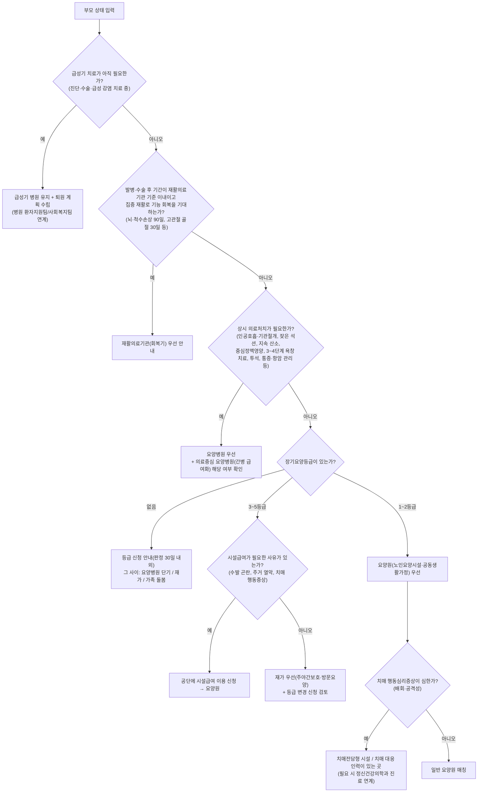
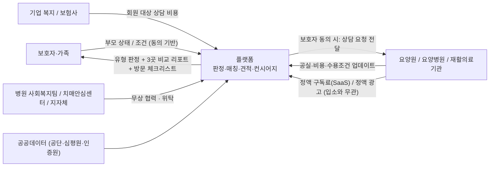
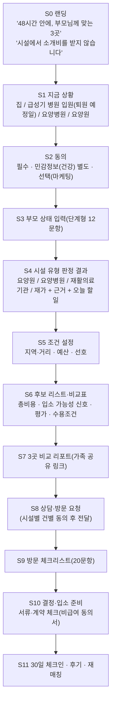

# 부모님 요양시설 비교·상담·매칭 플랫폼 사업 분석 (A to Z)

> **질문:** "우리 부모님에게 어느 요양원(요양병원)이 맞을까?"
> **대상 사업:** 전국 요양원·요양병원 비교·상담·견적 플랫폼
> **분석 관점:** 창업자 · 헬스케어 플랫폼 전문가 · 요양산업 전문가 · 규제 전문가 · 투자자
> **기준일:** 2026-10-04

**표기 규칙**

| 표기 | 의미 |
|---|---|
| **[확인]** | 법령·판례·정부/공공기관 자료를 검색으로 확인한 내용 |
| **[보도]** | 언론 보도에 근거한 내용(수치는 보도 시점 기준) |
| **[추정]** | 분석자의 추정. 가정을 함께 적었음 |
| **[확인필요]** | 사업 착수 전에 원문, 유권해석, 직접 조사로 다시 확인해야 하는 내용 |

> **한계 고지:** 이 문서는 2026-10-04 기준으로 웹 검색을 통해 법령, 판례, 공공데이터 목록, 언론 보도를 교차 확인한 결과입니다. 작업 환경에서 국가법령정보센터(law.go.kr)·공공데이터포털(data.go.kr) 원문 페이지를 직접 열 수 없어 검색 결과와 2차 출처로 확인했습니다. **법률 자문이 아닙니다.** 수익모델을 확정하기 전에 ① 변호사 의견서와 ② 보건복지부 서면 질의 회신을 받아야 합니다(11.3절 질의서 초안 참고).

---

## 0. 한 페이지 결론

1. **문제의 본질.** 보호자는 대개 퇴원 통보 후 1~2주 안에 시설을 정해야 합니다. 그런데 요양원과 요양병원은 근거 법과 보험 체계가 다릅니다(요양원은 노인복지법·장기요양보험, 요양병원은 의료법·건강보험). 보호자는 둘을 구분하지 못한 채 수십 곳에 전화합니다. 공공데이터에도 **① 실제 월 총비용 ② 지금 입소할 수 있는지 ③ 우리 부모 상태를 받아주는지**는 나와 있지 않습니다. 정보 비대칭의 핵심이 이 세 가지입니다.
2. **'입소 성공당 수수료'에 대한 법률 결론**
   - **요양병원: 불가 [확인].** 의료법 제27조 제3항은 영리 목적의 환자 소개·알선·유인과 그 사주를 금지합니다(위반 시 3년 이하 징역 또는 3천만 원 이하 벌금). 대법원 2018도20928은 플랫폼이 진료비의 15~20%를 수수료로 받은 행위를 알선으로 판단했습니다. 강남언니 사건도 1심과 2심 모두 유죄였습니다.
   - **요양원(노인요양시설·공동생활가정): 불가 전제로 설계 [확인 + 해석].** 노인장기요양보험법 제35조 제6항은 영리 목적으로 금전 등 이익을 제공하거나 약속하는 방법으로 수급자를 장기요양기관에 소개·알선·유인하는 행위와 이를 조장하는 행위를 금지합니다(2년 이하 징역 또는 2천만 원 이하 벌금, 기관은 업무정지). 조문에 '이익 제공 방법'이라는 요건이 있어 해석의 여지는 남습니다. 그래도 입법 취지, 의료법 판례와의 유사성, 그리고 **시설이 업무정지를 우려해 계약 자체를 피할 위험**을 고려하면 성과연동 과금은 사업의 근간을 흔드는 리스크입니다. 보호자에게 캐시백·상품권을 주는 것은 명백히 금지입니다.
   - **허용 가능성이 높은 모델:** 입소와 무관한 시설 정액 구독(SaaS), 광고임을 명확히 표시한 정액 광고, 보호자·기업·보험사가 내는 상담료, 지자체 위탁. 대법원 2021도10046은 환자 측이 낸 대가에는 의료법 제27조 제3항의 '영리 목적'이 성립하지 않는다고 봤습니다. 다만 개별 사안마다 판단은 달라질 수 있습니다.
3. **경쟁 상황.** 단순 검색·비교는 이미 레드오션입니다. 공단 누리집, 실버케어365, 요양24, 또하나의가족, 케어닥 등이 있습니다. 비어 있는 틈은 네 가지입니다.
   - (a) 요양원과 요양병원을 **부모 상태 기준으로 함께** 보는 유형 판정
   - (b) 실사 기반의 **실제 총비용 견적**
   - (c) **입소 가능 여부 확인**
   - (d) 시설로부터 **성과보수를 받지 않는 중립성**
4. **MVP.** ② 부모 상태 기반 매칭과 ④ 비용 비교견적을 합친 **'3곳 비교 리포트' 컨시어지**로 시작합니다. 1개 생활권에서 시설 30~50곳을 실사하고, 보호자 20~30건을 무료로 매칭합니다. 앱은 개발하지 않고 노코드 도구로 운영합니다.
5. **수익.** 1년 차에는 시설 정액 SaaS(상담·대기자 관리, 프로필)와 B2B2C(기업 복지·보험사)를 엽니다. **성공보수는 쓰지 않습니다.**
6. **90일 Go 조건.**
   - 보호자: 매칭 20건 이상, 리포트를 보고 방문한 비율 60% 이상, 추천 3곳 중 입소 결정 30% 이상, NPS 50 이상
   - 시설: 접촉 50곳 중 데이터 협조 60% 이상, 정액 유료 LOI 10곳 이상
   - B2B2C: 파일럿 협의 1건 이상
7. **사업성 판정: 조건부 가능.**
   - '요양시설판 호텔예약(성공수수료형 OTA)'은 국내법상 성립하지 않습니다.
   - 성립하는 조합은 **'신뢰받는 중립 매칭 + 시설 SaaS + B2B2C 유통'**입니다. 이 조합의 3년 차 매출 잠재력은 수십억 원대로 봅니다 [추정].
   - 투자 관점의 큰 그림은 이를 시니어 돌봄 전반(재가, 간병, 시니어하우징, 보험)으로 들어가는 **'의사결정 관문(Decision Gateway)'**으로 삼는 것입니다.

---

## 1. 시장 문제

### 1.1 거시 지표

| 지표 | 수치 | 근거 |
|---|---|---|
| 65세 이상 인구 | 1,024만 명(전체의 20.0%), 2024-12-23 초고령사회 진입 | [보도] 행정안전부 발표 |
| 장기요양 인정자 | 123만 5천 명(2025년, 전년 대비 +6.0%) | [확인] 건보공단 2025 통계연보(2026-06-30 발표) |
| 장기요양 급여비 | 17조 6,840억 원(2025년). 이 중 시설급여 공단부담금 5조 9,455억 원(36.8%) | [확인] 같은 자료 |
| 장기요양기관 | 29,734곳(재가 23,373, 시설 6,361), 2025-12 기준 | [확인] 같은 자료 |
| 노인의료복지시설 | 6,139곳, 이용자 242,974명(2023년) | [보도] 복지부 「노인복지시설 현황」 인용 |
| 요양병원 | 1,464곳(2021) → 1,306곳(2025)으로 감소 추세 | [보도] 건강보험통계 기반 보도 |
| 시설 질 분포 | 2025년 시설급여 평가 5,406곳 중 A 26.0%, B 39.3%, C·D 27.9%, E 6.8% | [확인] 건보공단 평가 결과 공개 |
| 우수 시설 대기 | A등급 노인요양시설 대기 인원이 정원의 44%(2024-12), 입소까지 1년 이상 | [보도] 헤럴드경제(2026-03) |
| 서울 공립 대기 | 서울요양원 정원 150명에 대기 1,379명(약 4년 대기) | [보도] |
| 요양병원 간병비 | 공동간병 월 60~90만 원, 개인간병 월 약 370만 원 | [보도] 서울신문(2026-07-28) |
| 제도 변화 | 2026-03-27 돌봄통합지원법 전국 시행. 2027년 상반기 요양병원 간병비 건보 시범 적용(본인부담 약 30%) | [확인/보도] |

### 1.2 구조적 문제 5가지

1. **법·보험 체계가 둘로 나뉘어 있는데, 보호자는 하나로 인식합니다.**
   - 요양원은 노인복지법상 노인의료복지시설이고, 장기요양보험에서 시설급여를 받습니다.
   - 요양병원은 의료법상 의료기관이고, 건강보험이 적용됩니다.
   - 보호자는 둘 다 '요양시설'로 묶어 생각하지만 대상자, 비용 구조, 정보 출처(공단 vs 심평원), 규제가 모두 다릅니다.
   - 장기요양급여와 요양병원 입원은 동시에 이용할 수 없습니다 [확인].
2. **수급이 양극화되어 있습니다.** A등급이나 공립 시설은 1년 이상 기다려야 하는 반면, 중소 시설에는 공실이 있습니다. 시장이 '정보 연결'에 실패하고 있다는 신호입니다.
3. **총비용이 보이지 않습니다.**
   - 요양원의 급여 본인부담금은 등급별로 표준화되어 있습니다(2026년 1등급 월 약 55.8만 원).
   - 하지만 식재료비, 상급침실료, 이미용비 같은 비급여 항목이 시설마다 다릅니다.
   - 요양병원은 간병비(전액 본인부담, 2027년부터 일부 급여화)가 총액을 좌우합니다.
4. **제도가 자주 바뀝니다.**
   - 2025년부터 요양보호사 배치기준이 입소자 2.1명당 1명으로 강화되었습니다(기존 시설은 2026년 말까지 유예). 이 기준이 적법하다는 1심 판결도 2026-08에 나왔습니다 [보도].
   - 2026-03-27 통합돌봄이 시행되었습니다.
   - 2027년 '의료중심 요양병원' 간병비 급여화가 시작됩니다.
   - 시설 정보는 계속 최신으로 유지되어야 합니다.
5. **의사결정이 정서적·가족적으로 복잡합니다.** 형제간 비용 분담, 부모 본인의 거부감, 죄책감이 얽혀 있어 '정보'만으로는 결정이 끝나지 않습니다.

### 1.3 보호자 여정 9단계 분해

> 각 단계에서 **가장 큰 불편**과 **정보 비대칭(누가 알고 누가 모르는가)**을 짚었습니다.

| # | 단계 | 보호자가 하는 일 | 가장 큰 불편 | 정보 비대칭 | 현재 대안 | 우리가 줄 것 |
|---|---|---|---|---|---|---|
| ① | **문제 발생** | 낙상·뇌졸중으로 입원, 치매 악화, 주 보호자 소진 | **시간 압박.** 급성기 병원이 퇴원을 재촉하는데 무엇부터 할지 모름 | 병원은 퇴원 일정과 의료적 필요를 알지만, 보호자는 다음 선택지를 모름 | 병원 사회복지팀(있는 곳만), 지인 | '지금 상황' 3문항으로 **오늘 할 일 체크리스트** 제공(등급 신청, 의사소견서, 퇴원일 조율) |
| ② | **요양원/요양병원 판단** | 둘의 차이를 검색 | 등급이 필요한지, 의료처치가 가능한지, 간병비가 왜 다른지 모름 | **이해상충.** 요양병원 상담실은 입원을, 요양원은 입소를 권함 | 블로그, 맘카페, 지인 | **부모 상태 기반 유형 판정**과 근거 설명(3장) |
| ③ | **시설 검색** | 공단 누리집, 네이버 지도·블로그 | 공단(요양원)과 심평원(요양병원) 정보가 따로 있음. 광고성 블로그. 우리 부모를 받아줄지 알 수 없음 | 광고비를 쓰는 시설만 눈에 띔 | 공단 '장기요양기관 찾기', 검색 광고 | 두 종류를 합친 통합 DB와 **상태 조건 필터** |
| ④ | **전화 문의** | 10~30곳에 전화 [추정] | 같은 질문 반복, 응대 편차, 업무시간 제약 | 시설이 조건에 따라 "가능할 수도"라고 모호하게 답함 | 직접 전화 | **표준 조사표**로 대신 확인하고, 시설별 '수용조건 프로필' 제공 |
| ⑤ | **비용 확인** | "한 달에 얼마인가요?" | 급여·비급여·간병비 구조가 어렵고, '월 비용'에 무엇이 포함되는지(식재료비, 기저귀) 시설마다 다름 | 시설은 총액을 알지만 표준 견적서를 주는 관행이 없음 | 구두 안내 | **표준 월 총비용 견적서**(급여 본인부담 + 비급여 항목별 + 간병비 + 실비)와 감경 계산 |
| ⑥ | **입소 가능 여부** | "자리 있나요? 대기 몇 번이에요?" | 공식 정원·현원과 실제가 다름(남녀 병실, 와상·치매실 구분). 대기 등록 후 연락이 없음 | 실시간 공실과 대기 순번은 **시설만 앎** | 반복 전화 | 시설의 주 1회 빈자리 업데이트, 컨시어지의 직접 확인, **입소 가능성 신호** |
| ⑦ | **방문** | 연차를 내고 2~5곳 방문 | 무엇을 봐야 할지 모름. 보여주기식 투어 | 야간 인력, 낙상·욕창 관리, 체위변경 같은 실제 케어 품질은 보이지 않음 | 즉흥 방문 | **방문 체크리스트 20문항**, 평가·인력 데이터 사전 제공, 일정 묶음 예약 |
| ⑧ | **결정** | 가족 회의 | 형제간 의견 충돌, 부모의 거부, 비교 기준 없음 | 후기가 광고이거나 단편적 | 카톡 단톡방 | **가족 공유용 비교 리포트**(링크)와 결정 기준 가중치 |
| ⑨ | **입소** | 계약, 서류, 준비물 | 비급여 동의서와 퇴소 규정을 모름. 적응 실패 시 다시 탐색해야 함 | 계약 조건은 시설만 앎 | 시설 안내 | 서류·계약 체크리스트, **30일 체크인**, 맞지 않을 때 재매칭 |

**정리:** 9단계 중 보호자가 실제로 비용을 치르는 구간은 ④~⑥입니다(시간, 전화, 불확실성). 이 구간의 정보는 공공데이터로 해결되지 않고 **시설 협조와 직접 조사**로만 얻을 수 있습니다. 바로 이 부분이 진입장벽이자 해자가 됩니다.

---

## 2. 보호자 Pain Point TOP 10

> 순위는 강도(빈도 × 심각도 × 대체재 부재)를 기준으로 한 [추정]입니다. 컨시어지 MVP 인터뷰(7장)에서 다시 검증합니다.

| 순위 | Pain Point | 정보 비대칭 유형 | 해결 기능 | 검증 질문(인터뷰) |
|---|---|---|---|---|
| 1 | **지금 입소 가능한 곳을 모른다** | 공실·대기 정보가 시설에 독점됨 | 입소 가능성 신호, 컨시어지 확인, 대기 알림 | "전화한 곳 중 실제 자리가 있던 곳은 몇 곳이었나요?" |
| 2 | **요양원과 요양병원 중 무엇이 맞는지 모른다** | 제도 지식 격차, 상담 주체의 이해상충 | 상태 기반 유형 판정과 근거 제시 | "처음에 요양원과 요양병원을 어떻게 구분하셨나요?" |
| 3 | **한 달에 실제로 얼마인지 모른다** | 비급여·간병비 비공개, 견적 관행 부재 | 표준 월 총비용 견적서 | "계약 후 예상과 달랐던 비용이 있었나요?" |
| 4 | **우리 부모 상태를 받아줄지 모른다**(와상, 경관영양, 석션, 치매 행동증상, 욕창) | 수용 기준이 비공개이고 시설마다 다름 | 시설별 수용조건 프로필, 하드 필터 | "상태 때문에 거절당한 적이 있나요?" |
| 5 | **시간이 없다**(퇴원 통보 1~2주) | 병원과 보호자 간 일정 정보 격차 | 48시간 리포트 SLA, 오늘 할 일 체크리스트 | "결정까지 며칠이 걸렸나요? 기한이 있었나요?" |
| 6 | **케어 품질을 판단할 수 없다** | 평가등급의 의미와 실제 인력이 보이지 않음 | 평가등급 해설, 인력비 실측, 방문 체크리스트 | "무엇을 보고 좋은 곳이라고 판단하셨나요?" |
| 7 | **전화·방문에 드는 시간과 감정노동** | 같은 질문 반복 | 대리 확인, 방문 일정 묶음 | "전화와 방문에 총 몇 시간을 쓰셨나요?" |
| 8 | **정보 출처를 믿을 수 없다**(광고, 브로커) | 대가 관계가 표시되지 않음 | **중립성 헌장**(성과보수 0, 광고 표시) | "추천을 믿지 못했던 경험이 있나요?" |
| 9 | **등급 신청과 감경 제도가 복잡하다** | 행정 지식 격차 | 등급 신청 가이드, 감경 계산기 | "등급 신청에서 막혔던 부분은?" |
| 10 | **입소 후가 불안하다**(적응, 방임 걱정, 소통) | 시설 내부 정보가 보이지 않음 | 면회·소통 정책 데이터, 30일 체크인, 재매칭 | "입소 후 첫 달에 가장 걱정됐던 것은?" |

---

## 3. 요양원 / 요양병원 선택 로직

### 3.1 제도 비교: 둘은 **별개의 시설 유형**입니다

| 구분 | **요양원**(노인요양시설 / 노인요양공동생활가정) | **요양병원** |
|---|---|---|
| 근거 법 | 노인복지법 제34조(노인의료복지시설), 노인장기요양보험법(장기요양기관 지정) | 의료법 제3조(병원급 의료기관 중 요양병원) |
| 성격 | **생활·돌봄 시설**. 장기 거주 | **의료기관**. 치료와 요양 |
| 대상자 | 장기요양 **1~2등급**이 원칙. 3~5등급은 공단이 시설급여 필요를 인정한 경우(가족 수발 곤란, 주거환경 열악, 치매 행동증상 등). 인지지원등급은 입소 불가 [확인] | **노인성 질환자, 만성질환자, 수술·상해 후 회복기 환자**로서 주로 요양이 필요한 사람. 법정 감염병 환자와 정신질환자는 제외하되 **노인성 치매는 입원 가능**(의료법 시행규칙 제36조) [확인] |
| 진입 요건 | **장기요양등급 필수**. 신청 후 30일 안에 판정이 원칙이며 30일 연장 가능 [확인] | 등급 불필요. 의사 판단에 따라 입원 |
| 의료진 | 의사는 상주하지 않음. 촉탁의(계약의사)가 입소자별로 월 2회 이상 진찰. 간호(조무)사는 입소자 25명당 1명 [확인] | 의사·간호사 상주(의료법상 인력기준) |
| 돌봄 인력 | 요양보호사가 입소자 2.1명당 1명(2025년부터, 기존 시설은 2026년 말까지 2.3:1 유예) [확인] | 간병인은 법정 인력이 아님. 공동간병이나 개인간병을 별도로 고용(2027년부터 일부 급여화) |
| 재원·본인부담 | 장기요양보험. 본인부담 20%(감경 대상은 8~12%, 기초수급자 0%). 2026년 1등급 1일 수가 93,070원, 월 본인부담 약 55.8만 원 [확인] | 건강보험. 입원진료비 본인부담(일당정액수가, 환자분류군별)과 식대 [확인] |
| 비급여 | **식재료비, 상급침실 이용 추가비용, 이·미용비** 등(장기요양법 시행규칙상 비급여 대상) [확인] | 상급병실료, 간병비, 각종 비급여 진료 |
| 대표 월 비용 | 급여 본인부담 49~56만 원 + 식재료비 등을 더해 **월 80~120만 원대**(일반실 기준, 시설마다 다름) [보도/추정] | 진료비·식대 본인부담 + **간병비(공동 60~90만 원)** + 상급병실을 더해 **월 150~300만 원 이상** [보도/추정] |
| 질 평가 | 건보공단 장기요양기관 평가. A~E 등급, 3년 주기 [확인] | 심평원 요양병원 입원급여 적정성 평가(등급), 의료기관평가인증원 **의무 인증**(4주기 2025~2028) [확인] |
| 공개 정보 의무 | 장기요양법 제34조에 따라 공단 누리집에 사진, 인력 종류별 종사자 수, **정원·현원**, 급여 종류, **비급여 항목별 비용**을 게시해야 함 [확인] | 심평원 공개 정보: 인력, 장비, 간호등급, 식대가산, 비급여 가격 등 [확인] |
| 중복 이용 | 요양병원에 입원하면 장기요양급여를 받을 수 없음 [확인] | 같음 |
| 알선 금지 조항 | **장기요양법 제35조 제6항** | **의료법 제27조 제3항** |
| 광고 규제 | 표시광고법 등 일반 규정 | **의료법 제56·57조**(의료광고 금지사항, 사전심의) |

**인접 유형(판정 결과로 함께 안내합니다)**

| 유형 | 언제 맞는가 | 메모 |
|---|---|---|
| **재활의료기관**(회복기) | 뇌손상·척수손상은 발병 후 90일 이내 입원(최대 180일). 고관절·골반·대퇴 골절은 수술 후 30일 이내 입원 [확인] | 3기 지정 71곳(2026-02) [보도]. "아직 회복 가능성이 있다"면 요양병원보다 먼저 검토 |
| **노인요양공동생활가정** | 소규모 가정형(정원 9명 이하). 요양원과 같은 등급 기준 | 가정적 분위기를 원할 때 |
| **치매전담형 장기요양기관** | 치매가 있는 2~5등급 | 전담실과 인력 기준 강화 [확인]. 지정 기관 수가 적음 |
| **재가(주야간보호, 방문요양)** | 3~5등급이고 가족 돌봄이 가능할 때 | 시설 입소의 대안 |
| **실버타운(노인복지주택)** | 독립 생활이 가능할 때 | **이번 사업 범위 밖**. 별도 법률(중개 등) 검토 필요 [확인필요] |

### 3.2 유형 판정 알고리즘



> **표현 원칙:** 이 로직은 **'시설 유형 정보 안내'**입니다. 진단이나 의학적 판단이 아닙니다. 의료처치 필요도는 **주치의 소견서와 의사소견서를 기준**으로 하라고 안내합니다. 비의료 건강관리서비스 가이드라인은 질병의 진단이나 병명·병상 확인 같은 의학적 판단이 필요한 상담을 의료행위로 봅니다 [확인].

### 3.3 입력 변수가 판정과 매칭에 미치는 영향

| 입력 변수 | 판정 단계 영향 | 매칭(필터·점수) 영향 | 민감정보 |
|---|---|---|---|
| 연령 | 65세 미만이면 노인성 질병 여부로 장기요양 신청 자격 확인 | 낮음 | 아님 |
| 장기요양등급 | **결정적.** 없으면 요양원 불가, 1~2등급이면 요양원 우선 | 등급별 본인부담 계산 | 건강정보(민감) |
| 주요 질환 | 의료 필요도 판정(뇌졸중, 파킨슨, 암, 당뇨 합병증 등) | 의료지원 역량 점수 | 민감 |
| 치매 여부와 정도 | 치매전담형 여부, 행동증상 대응 | 치매실, 인력, 배회 방지 설비 | 민감 |
| 거동 수준 | 낙상 위험 | 재활 프로그램, 이동보조 인력 | 민감 |
| 와상 여부 | 요양원도 가능하나 체위변경 역량 확인 필요 | 특수 매트리스, 와상 비율, 야간 인력 | 민감 |
| 재활 필요성 | 회복기 → 재활의료기관, 유지기 → 요양병원·요양원 재활 프로그램 | 물리치료사 유무, 재활실 | 민감 |
| 의료처치 필요성 | **결정적**(3.4 체크리스트) | 수용조건 하드 필터 | 민감 |
| 간병 요구 | 1:1 간병 필요 시 요양병원의 개인간병 비용 반영 | 간병 형태와 비용 | 민감 |
| 식사 형태 | 경관영양이면 수용 가능 시설로 제한 | 일반식, 다진식, 죽, 유동식, 경관 | 민감 |
| 희망 지역 / 가족과의 거리 | — | 거리·대중교통 시간 하드 필터와 점수 | 아님(위치정보 수집 방식 주의) |
| 월 예산 | 감경 대상 여부(기초·차상위·소득) | 총비용 상한 필터 | 경제정보 |
| 원하는 시설 조건 | — | 1인실, 종교, 프로그램, 면회 정책, 텃밭·산책, 신축, 평가등급 | 신념(종교)은 민감 |

### 3.4 의료 필요도 체크리스트(서비스 설계용)

| 요양병원 우선 신호 | 요양원 가능(시설별 확인 필수) | 판단 보류(의사 소견 필요) |
|---|---|---|
| 인공호흡기, 기관절개관 관리 | 경관영양(비위관, 위루) | 잦은 발열·폐렴 재발 |
| 하루 여러 번 석션 | 유치도뇨관 | 최근 3개월 내 2회 이상 재입원 |
| 지속 산소요법 | 인슐린 투여(간호사 근무 시간 확인) | 체중 급감, 연하곤란 진행 |
| 중심정맥영양, 수액 상시 투여 | 1~2단계 욕창 관리 | 섬망 |
| 3~4단계 욕창 치료 | 치매 행동증상(치매전담실·인력이 있으면) | 항응고제 조절 중 |
| 투석(이송이 가능한 병원) | 와상(체위변경 역량 확인) | — |
| 항암, 통증 조절, 말기 돌봄 | — | — |

### 3.5 2027년 간병비 급여화 반영 로직 [보도, 시행 세부는 확인필요]

- **대상 병원:** '의료중심 요양병원'. 의료기관 인증을 받고 100병상 이상인 곳 중에서 선정합니다. 연도별 기관 수는 고정하지 않고 병상과 인력 상황에 맞춰 확대합니다.
- **대상 환자:** 의료최고도·고도와 중도 일부, 중증·희귀질환, **치매·파킨슨 환자**, **장기요양 1·2등급 입원 환자** 등. 최대 약 8.5만 명까지 확대할 계획입니다.
- **본인부담:** 간병비가 100% 본인부담에서 **30% 안팎**으로 낮아집니다. 2027년 상반기 시범 적용 목표입니다.
- **제품 반영:**
  - 시설 DB에 `의료중심요양병원_지정여부`와 `간병급여_적용병상` 필드를 추가합니다.
  - 판정 결과에 "간병비 급여 대상일 가능성이 있음"을 표시합니다.
  - 요양원 대비 요양병원의 총비용 비교를 다시 계산합니다.
  - **이 변화가 생기는 시점에는 보호자의 혼란이 커집니다.** 콘텐츠와 상담 수요가 몰리는 기회입니다.

---

## 4. 경쟁사 분석

### 4.1 국내

| 서비스 | 유형 | 서비스 방식 | 수익모델 | 강점 | 약점 | 우리가 파고들 틈 |
|---|---|---|---|---|---|---|
| **건보공단 노인장기요양보험 누리집 / 스마트장기요양 앱** | 공공 | 전국 장기요양기관 검색(지역, 급여 종류, 정원, 이용 가능 여부 등), 평가 결과 | 없음 | 공식 데이터, 신뢰도, 무료 | **요양병원 없음**. 비교·추천·비용 총액 없음. "실제와 다를 수 있으니 전화로 확인하라"고 고지 | 공식 데이터 위에 **상태 맞춤, 총비용, 확인된 공실** 정보를 얹기 |
| **심평원 병원평가 / 건강e음** | 공공 | 요양병원 적정성 평가, 비급여 가격 공개 | 없음 | 공식 평가 | 요양원 없음. 간병비 정보 없음 | 요양원과 요양병원을 한 화면에서 비교 |
| **케어닥** | 민간(시니어 종합) | 2018년 공공데이터 기반 **요양병원 시설 안내·등급 공개**로 시작. 현재 간병인 매칭, 방문요양, **시니어하우징**(케어홈, 너싱홈 프리미오) | 간병 매칭 수수료, 시설 운영 수익 | 브랜드, 누적 투자 약 530억 원, 시니어하우징 PF 누적 1,000억 원 이상, 2027년 상장 목표 [보도] | 직영 시설과 간병 사업 쪽으로 무게가 이동해 **중립 비교의 동기가 약해짐** | 직영 시설이 없는 **중립 비교**와 요양원 정밀 데이터 |
| **케어링** | 민간(재가 운영사) | 방문요양·주간보호 직영(전국 수십 개 기관), **등급 신청 무료 대행**, 프리미엄 요양원 '케어링빌리지', 대량의 SEO 가이드 콘텐츠 | 장기요양 급여(기관 운영) | 콘텐츠와 검색 유입, 운영 역량 | **자사 기관 연결이 목적**(이해상충) | 자사 시설이 없는 중립성. 콘텐츠 경쟁은 필수 |
| **또하나의가족**(헥톤프로젝트, GC녹십자 계열) | 민간(커머스와 정보) | 시설 약 4만 곳 검색, 등급 신청 간소화, 보호자 커뮤니티 | **복지용구 판매·대여** | 대기업 계열, 커뮤니티 | 시설 데이터가 공공데이터 수준. 매칭·견적 없음 | 상태 기반 매칭과 실사 데이터. 제휴 대상도 될 수 있음 |
| **실버케어365**((주)프라임리츠) | 민간(비교) | 요양원·주야간보호 약 12,231곳의 평가등급, 한 달 비용, **'빈자리'를 공단 자료로 매일 갱신**해 비교 [확인] | 확인 불가 | 빈자리와 비용 비교라는 핵심 가치를 이미 제시 | 공식 정원·현원 기반이라 **'실제 입소 가능'과 다름**. 요양병원 없음. 상태 매칭 없음 | **검증된(확인된) 공실**과 수용조건. 이 서비스의 존재는 '공실 수요'가 있다는 증거이기도 함 |
| **요양24**(yoyang24.kr) | 민간(정보) | 요양원·주야간보호·방문요양 약 58,001곳의 평가·리뷰·비용, AI 상담 [확인] | 확인 불가(콘텐츠·광고로 추정) | 데이터 규모, AI 상담 | 공공데이터 재가공 위주 | 실사와 컨시어지 |
| **요양이**(주식회사 요양이) | 민간(앱) | 태그(프리미엄, 경제적, 재활, 종교 등) 기반 요양원 탐색과 상담 연결 | 확인 불가(시설 제휴로 추정) | 태그 UX | 규모, 데이터 깊이 | 상태 기반 판정 |
| **힐링미**(메디스쿨) | 민간(앱) | 암요양병원 비교와 암환자 상담 | 확인 불가(병원 광고로 추정) | 질환 특화 | 의료광고·알선 규제에 노출된 영역 | 규제를 준수하는 설계로 차별화 |
| **쾌유** | 민간(앱) | 재활병원 검색·연결(상급병원 주변 재활병원) | 확인 불가 | 회복기 재활 특화 | 범위가 좁음 | 재활에서 요양으로 이어지는 연속 여정 |
| **기관 관리 SW**(케어포 등) | B2B | 장기요양기관 청구·기록 관리, 가족 앱 | 기관 구독 | **대부분의 시설과 이미 계약** | 보호자 탐색 기능 없음 | **정원·현원·대기 데이터 연동 제휴 대상**(시설 동의 필요) |
| **오프라인 채널** | — | 병원 의료사회복지팀·퇴원 코디, 요양병원 상담실장, 지인, 맘카페, 네이버 블로그·플레이스 광고 | 광고비. 일부 **불법 소개비** 관행 | 신뢰 관계(사회복지팀) | 지역·인맥에 따라 편차. 브로커 문제 | 사회복지팀에 **무료 도구**를 제공해 협업 |

> 불법 소개비 관행은 보도로 확인됩니다. 2014년 요양병원이 응급차 운전자 등에게 소개비를 주고 환자 444명을 유치한 사건에서는 의료급여 환자 1인당 20~30만 원, 건강보험 환자 1인당 40~50만 원이 오갔습니다. 2025-12 창원지법 판결에서는 환자 1인당 20~80만 원을 브로커에게 약속한 의사 부부가 실형을 받았습니다 [보도].

### 4.2 해외 레퍼런스와 교훈

| 서비스 | 모델 | 시사점 |
|---|---|---|
| **A Place for Mom**(미국) | 가족에게 무료, **제휴 시설에서 소개 수수료**를 받음 | 2024-06 미 상원 고령화특위가 조사에 착수했습니다. 수수료를 내는 시설만 추천한다는 점, Medicaid 가구가 배제된다는 의혹, 추천받은 가구의 약 40%가 예산을 넘는 시설에 입주했다는 점이 지적됐습니다. 2025년 미주리주에서는 재정적 관계 공개를 의무화하는 법안이 나왔습니다 [확인]. **합법인 곳에서도 성공수수료는 추천 편향 논란으로 이어집니다.** |
| **carehome.co.uk**(영국) | 기본 등록은 무료, 시설이 **Enhanced/Platinum 구독**. 약 16,500곳 등록, 리뷰 41.5만 건 이상, 연 1,500만 방문 [확인] | **구독과 리뷰 기반 모델이 지속 가능**합니다. 리뷰 규모 자체가 해자가 됩니다. 국내법과도 맞는 구조입니다. |
| **LIFULL 介護**(일본) | 시설 약 5.9만 곳 게재. **월 정액 게재료**를 받고 소개료는 없음. 일반 소개업체는 1건당 약 20만 엔 [확인] | 일본은 성공수수료형 소개업이 합법이지만 부작용이 큽니다. 후생노동성은 '고액 소개료 부적절'로 지도지침을 개정했고, 업계 단체(高住連)는 신고·공표제(2025-07 기준 703개 사업자)를 운영하며 **입주 축하금·캐시백을 금지**했습니다(2024-12) [확인]. |

**교훈 3가지**

1. 성공수수료 모델은 합법인 나라에서도 **중립성 훼손 → 규제 → 신뢰 하락**의 경로를 밟았습니다.
2. 오래 살아남은 모델은 **정액 게재(구독)와 리뷰 축적**입니다.
3. 보호자에게 주는 금전 인센티브(축하금)는 업계 스스로도 금지하는 방향입니다. 한국에서는 장기요양법 제35조 제6항에 직접 걸립니다.

### 4.3 포지셔닝 맵

```
                정보 깊이 (실사·상태 맞춤·확인된 공실)
                              ▲
                              │      ★ 우리 (중립 + 실사 + 상태 매칭)
          케어링(자사 연결)    │
          케어닥(간병·하우징)  │
  이해상충 ◀──────────────────┼──────────────────▶ 중립
 (자사 시설/                  │   실버케어365 · 요양24 · 또하나의가족
  성과보수)                   │   공단 누리집 · 심평원
                              │
                              ▼
                 공공데이터 재가공 수준
```

### 4.4 우리가 파고들 틈 5가지

1. **두 체계를 가로지르는 판정:** 요양원(공단)과 요양병원(심평원) 정보가 분리되어 있습니다. 이를 부모 상태 하나로 묶어 판정하는 서비스는 사실상 없습니다.
2. **확인된 공실:** 경쟁사의 '빈자리'는 공식 정원·현원 차이입니다. 우리는 성별·병실 유형·케어 수준별 **실제 입소 가능 여부와 확인 시각**을 제공합니다.
3. **실제 총비용 견적:** 비급여 항목별 금액과 간병비를 넣은 표준 견적서입니다.
4. **중립성을 상품으로:** "시설에서 소개비를 받지 않습니다." 브로커와 자사 연결형 경쟁사 사이에서 가장 강한 메시지입니다.
5. **이행기 혼란 흡수:** 2026~2027년 통합돌봄과 간병비 급여화 시기에 보호자 수요가 몰릴 때 '최신 제도 반영 판정'을 제공합니다.

---

## 5. 전국 시설 DB 확보 방법

### 5.1 데이터 레이어

| 레이어 | 소스 | 방식 | 범위 | 갱신 | 합법성과 주의 |
|---|---|---|---|---|---|
| **L1 공공 API(요양원)** | 건보공단 「장기요양기관 검색 서비스」(data.go.kr 15059029), 「시설별 상세조회 서비스」(15058856) | REST API, 무료, 자동 승인 [확인] | 전국 장기요양기관 | 실시간 표기 | 공공데이터법 제3조에 따라 **영리 이용도 원칙적으로 허용** [확인]. 이용허락 범위(공공누리 유형)는 데이터셋별로 확인 |
| **L1 공공 파일(요양원)** | 「장기요양기관 시설별 현황」(15124763: 일반현황, **정원·현원**, 인력현황. 2026-06 기준), 「장기요양기관 평가 결과」(15104801: 등급, 총점, 영역별 점수. 2026-06-25 갱신), 「평가 5회 이상 A등급 기관」(15127484), 「치매관련급여 제공 기관」(15145962) | 파일 다운로드 | 전국 | 월~연 단위 | 같음 |
| **L1 공공 API(요양병원)** | 심평원 「병원정보서비스」(15001698), 「의료기관별상세정보서비스」(15001699: 시설, 진료과목, 장비, **식대가산, 간호등급**, 전문의 수, 기타 인력), 「병원평가정보서비스」(15094093, 요양병원 평가 포함), 「우수기관병원평가」(15094089), 「비급여진료비정보조회」(15001700) | REST API, 무료 [확인] | 전국 의료기관(종별 코드로 요양병원 필터) | 실시간~연 단위 | 같음. 비급여 공개 항목(상급병실료 등)이 요양병원에 얼마나 적용되는지는 [확인필요] |
| **L1 공공(인증)** | 의료기관평가인증원 「의료기관 인증현황」 API(15134308, 급성기). 요양병원은 의무인증 대상 [확인] | API, 웹 | 인증 기관 | 수시 | 요양병원 인증 데이터셋이 별도로 있는지 [확인필요] |
| **L1 공공(인허가)** | 지방행정 인허가 데이터(노인의료복지시설 등). **LOCALDATA는 2026-04-16 폐쇄되어 data.go.kr로 통합** [보도] | 파일, API | 전국 | 일 단위 | 개·폐업 감지용 |
| **L1 공공(재활)** | 복지부·국립재활원 지정 재활의료기관 명단 | 웹 공지 | 3기 71곳 | 지정 주기 | — |
| **L2 지오·교통** | 지도 API(지오코딩, 대중교통 소요시간) | API(상용 약관) | 전국 | — | 지도 API 약관과 위치정보법(사용자 위치 수집 시) |
| **L3 직접 실사** | 전화와 방문 표준 조사표(부록 B, 40문항) | 사람 | 초기 권역 30~50곳 → 확대 | 분기 1회 + 수시 | 시설 동의를 받고 수집. 사진은 시설 제공분 또는 촬영 동의 후 사용 |
| **L4 시설 셀프 입력** | 시설 관리자 포털, 카카오 원클릭 공실 업데이트 | 시설 입력 | 제휴 시설 | **주 1회 목표** | 정확성 서약과 '최근 업데이트' 배지 |
| **L5 보호자 후기** | **입소가 확인된 보호자**만 작성(계약서나 영수증으로 확인) | 구조화 문항 + 자유서술 | 누적 | 수시 | 요양병원 후기는 의료광고 쟁점이 있으므로 치료효과 서술을 제한(11장) |
| **L6 기관 SW 연동** | 케어포 등 장기요양 관리 프로그램 벤더 | API 제휴(시설 동의) | 해당 벤더 고객 | 실시간 | **실시간 공실 확보의 지름길**. 벤더와 시설 동의가 필수 |

**하지 말아야 할 것**

- 공단·심평원 웹페이지 스크래핑. API와 파일이 있으므로 그것을 씁니다.
- 네이버·카카오 리뷰와 사진 크롤링. 약관, 저작권, 데이터베이스권 침해 위험이 있습니다.
- 시설 홈페이지 사진 무단 사용.

### 5.2 확보할 데이터 정의(스키마)

> **P0** = 이것이 없으면 추천하지 않음 / **P1** = 비교 품질을 좌우 / **P2** = 차별화와 신뢰 보강

| 카테고리 | 필드 | 우선순위 | 1차 출처 | 의사결정 기여 |
|---|---|---|---|---|
| **기본** | 기관명, 유형(요양원 / 공동생활가정 / 요양병원 / 재활의료기관), 주소·좌표, 연락처, 설립 주체(공립/법인/개인), 개설일 | P0 | L1 | 식별, 거리 |
| **정원·현원 / 입소 가능성** | 정원, 현원, 남녀별 공실, 병실 유형별 공실(다인실/1인실, 치매실, 와상실), 대기 인원·순번, 예상 대기 기간, **확인 시각**, 확인 방식 | P0 | L1(정원·현원) + **L3/L4(공실·대기)** | Pain #1 해결 |
| **수용 조건** | 수용 가능 등급, 치매 행동증상, 와상, 경관영양, 석션, 산소, 도뇨관, 욕창 단계, 인슐린, 투석 이송, 감염(MRSA 등) 격리 가능 여부, 성별 제한 | **P0** | **L3/L4** | Pain #4, 하드 필터 |
| **비용** | 등급별 급여 본인부담(계산), 식재료비(월·일), 상급침실 추가비용, 이·미용비, 기저귀·위생용품, 간식, 촉탁의 진료비, 병원 동행비, 기타 실비. 요양병원은 **간병 형태별 비용(공동 몇 대 1 / 개인)**, 상급병실료 | **P0** | L1(공단 게시 비급여, 심평원 비급여) + **L3 검증** | Pain #3, 견적 |
| **인력** | 요양보호사 수(입소자 대비 실제 비율), 간호(조무)사 수와 근무시간, 야간 인력 배치, 사회복지사, 물리(작업)치료사, 영양사·조리원. 요양병원은 의사 수, 간호등급, 간병인 수 | P1 | L1(인력현황, 심평원 상세) + L3(야간) | 케어 품질의 대리 지표 |
| **평가·인증** | 공단 평가등급과 연도, 영역별 점수, 5회 이상 A 여부. 심평원 요양병원 평가 등급. 인증 등급과 기간. **의료중심 요양병원 지정 여부**(2027~) | P0 | L1 | Pain #6 |
| **의료 지원** | 촉탁의(진료과, 방문 주기), 협력 병원, 응급 이송 체계, 투약 관리, 정기 검진 | P1 | L3 | 의료 필요도 매칭 |
| **치매·재활** | 치매전담실 여부, 인지 프로그램, 배회 방지 설비, 물리치료실과 장비, 재활 프로그램 빈도 | P1 | L1(치매급여 기관) + L3 | 치매·재활 매칭 |
| **생활** | 식사 형태(일반, 다진식, 죽, 유동식, 경관), 직영 조리 여부, 프로그램(주간 일정표), 면회 정책(시간, 예약, 외출·외박), 종교, 1인실, 산책로·텃밭, 냉난방·목욕 주기, CCTV 운영과 보호자 열람 정책 | P1~P2 | L3/L4 | 선호 매칭 |
| **위치·접근** | 가족 거주지와의 거리·시간(차량, 대중교통), 주차 | P0 | L2 | 면회 지속 가능성 |
| **후기** | 구조화 점수(청결, 소통, 식사, 직원 친절, 비용 투명성, 면회 편의), 자유서술, 입소 기간 | P2 | L5 | 신뢰 |
| **메타** | 필드별 출처, 최종 확인일, 확인자, 검증 상태(공식 / 시설 입력 / 실사 확인 / 보호자 확인), 정보 불일치 신고 | P0 | 내부 | 신뢰와 법적 방어 |

### 5.3 입소 가능성 데이터 전략

1. **공식 정원·현원(L1)으로 1차 신호.** 현원이 정원보다 적으면 '공실 가능성'으로 봅니다. 단, 데이터가 늦게 반영되고 성별·병실 유형이 반영되지 않습니다.
2. **시설 셀프 업데이트(L4).** 카카오 알림톡으로 주 1회 "이번 주 남/여 공실 수, 대기 인원"을 묻고 시설은 버튼 3개로 답합니다. 응답한 시설에는 '최근 7일 확인' 배지를 줍니다.
3. **컨시어지 직접 확인(L3).** 리포트에 넣기 전 72시간 이내에 전화로 확인합니다.
4. **표시는 신호등 4단계로 합니다.**
   - **확인됨:** 72시간 이내에 확인했고, 해당 성별·케어 수준의 공실이 있음
   - **가능성 있음:** 공식 수치상 공실이 있거나 7일 이내 셀프 업데이트에서 공실
   - **대기:** 순번 N, 예상 n주
   - **미확인**
5. **중장기:** 기관 관리 SW 벤더와 연동하고(L6), 대기 등록을 대신 관리합니다(시설용 대기자 관리 툴, 9장).

### 5.4 비용 견적 표준 포맷(예시)

| 항목 | 요양원 A(1등급, 일반실) | 요양병원 B(의료중도, 공동간병) | 출처와 검증 |
|---|---|---|---|
| 급여 본인부담 | 558,420원(30일 × 93,070원 × 20%) [확인] | 입원진료비 본인부담(분류군, 인력가산에 따라 다름) | 공단 수가 / 병원 확인 |
| 식재료비(요양원) / 식대(요양병원) | 예) 330,000원 [시설 사례] | 식대 본인부담 | 실사 |
| 상급침실·병실료 | 0원(다인실) / 1인실이면 +○○ | 다인실 0 / 1~2인실 +○○ | 공단 게시, 심평원 비급여 |
| 간병비 | 해당 없음(요양보호사가 돌봄) | 공동간병 월 60~90만 원 [보도] / **2027년 의료중심 요양병원 급여화 시 약 30% 본인부담** | 실사 |
| 이·미용, 기저귀, 간식 등 실비 | 예) 2~10만 원 | 예) 5~15만 원 | 실사 |
| **월 예상 총액** | **약 90~110만 원** | **약 150~250만 원** | [추정] 시설마다 다름 |
| 감경 적용 시 | 감경 대상이면 급여 본인부담 8~12% | 본인부담상한제 등 | 공단 |

> 견적서에는 반드시 다음을 적습니다. "확인일: YYYY-MM-DD, 출처: 시설 확인(담당자 직함), 실제 계약 시 비급여 동의서로 최종 확인 필요."

### 5.5 후기 데이터 설계

- **작성 자격:** 입소(입원) 사실이 확인된 보호자. 계약서나 영수증 일부를 마스킹한 사본으로 확인합니다.
- **구조화 문항:** 청결, 직원 소통, 식사, 비용 투명성, 면회 편의, 입소 전 설명과의 일치도. 1~5점과 근거 서술.
- **요양병원 후기:** '치료 효과' 서술 칸을 두지 않습니다. 의료법 제56조 제2항의 치료경험담 금지 쟁점을 피하기 위해서입니다.
- **시설 권한:** 시설은 후기를 삭제할 수 없고, 공식 답변만 달 수 있습니다.
- **분리:** 유료 노출 영역과 후기 영역을 분리하고 **'광고' 표시**를 붙입니다(공정위 추천·보증 심사지침, 2024-12-01 개정 시행) [확인].

---

## 6. 서비스 구조

### 6.1 참여자와 가치 흐름



### 6.2 중립성 헌장(제품 원칙이자 마케팅 메시지)

1. **입소·입원 성과에 연동된 대가는 받지 않습니다.** 성공수수료, 건당 수수료, 매출 비율 수수료 모두 해당합니다.
2. **추천 순위는 유료 여부와 무관합니다.** 알고리즘의 요소와 가중치를 공개합니다.
3. 유료 노출은 '광고'로 표시하고 추천 리스트와 분리합니다.
4. 불리한 정보도 표시합니다. 낮은 평가등급, 인력 미달, 행정처분 이력(공개 자료) 등이 그렇습니다.
5. 보호자에게 금전적 인센티브(캐시백, 상품권, 입소 축하금)를 주지 않습니다.
6. 보호자 정보는 **보호자가 고른 시설에, 건별 동의를 받은 경우에만** 전달합니다.

### 6.3 기능 모듈

| 모듈 | 설명 | MVP | V1(6개월) | V2(12~18개월) |
|---|---|---|---|---|
| 상황 진단 | 지금 상황(집, 급성기 입원, 요양병원)과 긴급도 | 폼 | 웹 | 앱 |
| 유형 판정 엔진 | 3.2의 규칙 기반 판정과 근거 | 상담사가 시트 규칙으로 판정 | 웹 자동 판정 | 간병 급여화 등 제도 변경 자동 반영 |
| 시설 DB | L1~L5 통합 | 에어테이블/시트(권역 50곳 + L1 전국) | DB와 관리자 도구 | 기관 SW 연동 |
| 매칭 엔진 | 하드 필터 → 점수화 → 다양성 3곳(최적, 가성비, 빠른 입소) | 상담사 + 시트 점수 | 자동 추천과 상담사 검수 | 학습형 가중치 |
| 견적 엔진 | 표준 월 총비용과 감경 계산 | 시트 계산기 | 웹 계산기 | 시설 견적 직접 입력 |
| 컨시어지 콘솔 | 케이스 관리, SLA, 기록 | 노션/시트 | 내부 툴 | CRM |
| 리포트·공유 | 가족 공유 링크와 PDF | 노션 페이지 | 웹 리포트 | 가족 투표·코멘트 |
| 시설 포털 | 프로필, 공실 업데이트, 상담 inbox, 대기자 관리 | 카카오 알림톡 + 구글폼 | 웹 포털 | SaaS 정식판 |
| 후기 | 검증된 후기 | 인터뷰로 수집 | 웹 | 공개 |
| AI 보조 | 제도 FAQ, 리포트 초안 요약(**진단 금지**, 사람이 검수) | 내부 사용만 | 상담사 보조 | 보호자 셀프 Q&A(가드레일 포함) |

---

## 7. MVP

### 7.1 MVP 후보 6개 평가

> 1~5점이며 **높을수록 유리**합니다. 구현 난이도, 데이터 확보 난이도, 제휴 난이도, 규제 위험, 경쟁 강도는 '쉬움·낮음'일수록 높은 점수로 환산했습니다.
> 가중치: 문제 강도 15%, 시장 수요 15%, 구현 10%, 데이터 10%, 제휴 10%, 수익화 15%, 규제 10%, 경쟁 5%, 확장성 10%

| 후보 | 문제 강도 | 시장 수요 | 구현 | 데이터 | 제휴 | 수익화 | 규제 | 경쟁 | 확장성 | **가중합** |
|---|---|---|---|---|---|---|---|---|---|---|
| ① 시설 검색·비교 | 3 | 4 | 4 | 4 | 5 | 2 | 4 | **1** | 3 | **3.40** |
| ② 부모 상태 기반 매칭 | **5** | 4 | 3 | 3 | 4 | 3 | 3 | 3 | 4 | **3.65** |
| ③ AI 상담 | 4 | 3 | 3 | 3 | 5 | 2 | **2** | 3 | 4 | **3.20** |
| ④ 비용 비교견적 | **5** | 4 | 3 | 2 | 3 | 3 | 4 | 4 | 4 | **3.60** |
| ⑤ 실시간 입소가능 시설 연결 | **5** | **5** | 2 | **1** | **1** | 4 | 2 | 4 | 5 | **3.40** |
| ⑥ 병원 퇴원환자 연계 | **5** | 4 | 3 | 2 | **1** | 3 | 2 | 4 | 5 | **3.30** |
| **★ ②+④ 결합 컨시어지**(노코드, 1개 권역) | **5** | **5** | 4 | 2 | 4 | 3 | 3 | 4 | 4 | **3.85** |

**채점 근거(요약)**

- **①**은 경쟁이 가장 치열하고(공공과 민간 다수) 광고 외 수익화가 어렵습니다. 단독 MVP로는 차별화가 불가능합니다. 대신 내부 도구이자 SEO 입구로 씁니다.
- **②**는 Pain #2와 #4를 직접 해결합니다. 다만 수용조건 데이터는 실사가 필요합니다. 민감정보 처리 부담은 동의 설계로 관리할 수 있습니다.
- **③**은 신뢰 문제가 있습니다. 진단·의학적 판단으로 넘어갈 경계 위험(비의료 가이드라인), 민감정보를 국외 LLM으로 보낼 때의 국외 이전 문제도 있습니다. 단독 MVP로는 부적합하고 **상담사 보조**로 씁니다.
- **④**는 Pain #3을 해결합니다. 비급여와 간병비는 실사로만 정확해지므로 데이터 점수는 낮게 매겼습니다.
- **⑤**는 수요가 가장 강하지만 **실시간 공실은 시설 협조 없이는 불가능**합니다(데이터·제휴 1점). '예약'처럼 보이면 알선으로 오해받을 소지도 있습니다. 2단계 목표로 둡니다.
- **⑥**은 퇴원 압박이라는 강한 문제를 다룹니다. 하지만 병원 영업에 6~12개월이 걸리고, 의료법 제21조(환자 기록 제3자 제공 제한) 때문에 환자 동의가 필요합니다. 2019~2020년 요양병원 퇴원환자 지원사업의 지역사회 연계율이 3.9%에 그친 사례가 보여주듯 현장의 실행력이 약합니다 [보도]. **채널 실험**으로만 병행합니다. 급성기 퇴원지원 시범사업이 2027년 말까지 진행되고 연계 대상에 요양병원이 추가된 점은 기회입니다 [확인].

### 7.2 선정: '부모 상태 기반 3곳 비교 리포트' 컨시어지

- **정의:** 보호자가 부모 상태와 조건을 입력하면 **48시간 안에** 다음을 받습니다.
  - ① 시설 유형 판정(근거 포함)
  - ② 확인된 3곳: 최적 / 가성비 / 빠른 입소
  - ③ 표준 월 총비용 견적
  - ④ 입소 가능성 신호
  - ⑤ 방문 체크리스트
- **왜 이것인가:** Pain TOP 4(입소 가능, 유형 판정, 총비용, 수용조건)를 한 번에 다룹니다. 앱 개발 없이 바로 검증할 수 있습니다. 실사 과정 자체가 시설 제휴 영업이 됩니다.
- **범위에서 뺄 것:** 앱 개발, 전국 확장, AI 대화형 상담 공개, 결제 시스템, 실시간 예약

### 7.3 대안 2개와 권장안 비교

| 구분 | **더 공격적**('요양시설판 다나와/호텔예약') | **더 보수적**(30~50곳 컨시어지, 무료 3곳 비교) | **권장안** |
|---|---|---|---|
| 개념 | 상태 입력 → 추천 → 비용 비교 → 입소 가능 → 상담 예약까지 한 번에. 전국 단위 | 1개 지역 30~50곳 실사 데이터로 보호자에게 무료로 3곳 비교 | 보수안으로 시작 → 6개월 내 웹 제품화(②+④) → 18~24개월 공격안 비전 |
| 호텔예약 모델과의 차이 | 호텔 OTA는 재고와 가격이 공개되고, 즉시 확정되며, **10~20% 수수료**를 받음. 요양에서는 재고(공실)가 비공개·가변이고, 상담·방문·건강진단·계약을 거쳐야 하며, **성과 수수료는 위법(요양병원) 또는 고위험(요양원)** | — | '예약'은 **상담·방문 예약과 대기 등록**으로 재정의. 수익은 구독·광고·B2B2C |
| 장점 | 투자 유치용 스토리, 규모의 경제 | 비용이 낮음. 진짜 데이터와 진짜 니즈를 확보. 규제 리스크 최소 | 학습 속도와 규제 안전성 |
| 단점 | **핵심 데이터(공실·비급여)를 확보하지 못한 채 UI만 만들게 됨.** 수수료 모델 불가로 단위경제가 성립하지 않음. 마케팅비 소모 | 확장성 증명이 늦음. 무료라서 지불의향 신호가 약함 | 2단계 전환 시점을 판단해야 함 |
| 초기 비용 [추정] | 개발 3~5억 원 + 마케팅 | 인건비 중심 2~3명 × 3개월 | 같음(보수안) |
| 판정 | **현 단계 비권장**(비전으로만 유지) | **권장(시작점)** | **채택** |

### 7.4 컨시어지 MVP 상세 설계(매칭 20~30건)

**운영 흐름(SLA 48시간)**

| 단계 | 내용 | 담당 | 소요 |
|---|---|---|---|
| 0. 유입 | 랜딩 → 상황 3문항 → 상담 신청 | 보호자 | 3분 |
| 1. 동의 | 개인정보와 민감정보 **별도 동의**, 국외 이전 여부 고지(해당 시) | 보호자 | 2분 |
| 2. 상태 인터뷰 | 전화 20~30분. 상태 12문항 + 조건 8문항 | 상담사(사회복지사 또는 간호사 자격자 권장) | 30분 |
| 3. 유형 판정 | 3.2 규칙 적용. 애매하면 "주치의 확인 필요"로 표시 | 상담사 | 15분 |
| 4. 후보 추출 | 권역 DB에서 하드 필터 → 점수 → 상위 6곳 | 상담사 | 20분 |
| 5. 실시간 확인 | 6곳에 전화. 공실, 수용 가능 여부, 비용 확인 | 상담사 | 60~90분 |
| 6. 리포트 | 3곳 선정, 견적, 체크리스트. 노션 템플릿 | 상담사 | 30분 |
| 7. 전달·상담 | 카톡 링크와 15분 통화 | 상담사 | 15분 |
| 8. 연결(선택) | 보호자가 원하면 시설에 상담·방문 요청 전달(**건별 동의**) | 상담사 | 10분 |
| 9. 추적 | D+3, D+7, D+14에 방문·결정 여부 확인. 입소 시 D+30 체크인 | 상담사 | 20분 |

- **1건 원가 [추정]:** 약 4시간 × 시간당 2.5만 원 = **약 10만 원**. 목표는 V1 자동화 후 1.5시간입니다.
- **선행 작업:** 권역 시설 30~50곳 실사. 1곳당 전화 1시간 + 방문 2시간, 총 약 120~150시간입니다.

**도구 스택(개발 0원)**

웹빌더(아임웹, 우피, Framer 등) + 타입폼/구글폼 + 카카오 채널 + 에어테이블(시설 DB) + 노션(리포트) + 구글 캘린더 + 녹취는 동의를 받은 경우에만 합니다.

**실험 설계(20~30건 안에서)**

| 실험 | 방법 | 판정 기준 |
|---|---|---|
| E1 가치 | 무료 리포트를 제공하고 방문·결정 여부 추적 | 리포트를 보고 방문 ≥60%, 3곳 중 결정 ≥30% |
| E2 속도 | 48시간 SLA 준수율, 보호자 결정 소요일 | SLA ≥80%, 결정 중앙값 ≤14일 |
| E3 지불의향 | 리포트 전달 후 '프리미엄'(방문 동행, 계약서 검토, 대기 관리) **9.9만 원 / 19.9만 원** 제안(Fake door → 실결제) | 결제 의향 ≥20%, 실결제 ≥5건 |
| E4 중립성 메시지 | 랜딩 A/B: "시설에서 소개비를 받지 않습니다" 문구 유무 | 신청 전환율 차이 |
| E5 시설 반응 | 상담 요청을 받은 시설에 '정액 상품' 제안 | LOI ≥10곳 / 50곳 |
| E6 B2B2C | 기업 HR 3곳, 보험사 2곳에 파일럿 제안 | 파일럿 협의 ≥1건 |

### 7.5 검증할 핵심 가설

| ID | 가설 | 검증 지표 |
|---|---|---|
| H1 | 보호자는 시설 탐색에 2주 이상, 10곳 이상 전화를 쓴다 | 인터뷰 15명 중 10명 이상 |
| H2 | 70% 이상이 계약 전까지 실제 월 총액을 몰랐거나 예상과 달랐다 | 인터뷰 |
| H3 | 48시간 리포트를 받으면 60% 이상이 1곳 이상 방문한다 | E1 |
| H4 | '시설로부터 대가를 받지 않음'이 신뢰 이유 상위 3개 안에 든다 | 사후 설문 |
| H5 | 20% 이상이 9.9만 원 이상의 프리미엄 서비스에 지불한다 | E3 |
| H6 | 공실이 있는 시설의 60% 이상이 '정확한 상태 정보가 담긴 사전 동의 상담 요청'에 가치를 느낀다 | 시설 인터뷰 |
| H7 | 시설의 20% 이상이 월 10~30만 원 정액 상품에 LOI를 낸다 | E5 |
| H8 | 시설의 50% 이상이 이미 월 30만 원 이상을 홍보(블로그, 플레이스 광고 등)에 쓰고 있다 | 시설 인터뷰 |
| H9 | 주 1회 공실 업데이트에 30% 이상이 참여한다 | L4 응답률 |
| H10 | 기업 또는 보험사가 '부모 돌봄 컨시어지'를 복지·부가서비스로 구매한다 | E6 |

---

## 8. 화면 / 사용자 흐름

### 8.1 핵심 사용자 흐름



### 8.2 화면별 핵심 요소

| 화면 | 핵심 요소 | 설계 포인트 |
|---|---|---|
| S0 랜딩 | 가치 제안, 중립성 헌장 요약, 실제 리포트 샘플(가상 데이터), 상담 시작 CTA | 신뢰 요소(상담사 자격, 실사 시설 수, 데이터 확인일) |
| S1 상황 | 4개 선택지, 퇴원 예정일 | 긴급도에 따라 SLA 우선순위 |
| S2 동의 | 수집 항목·목적·보유기간, **민감정보 별도 동의**, 제3자 제공은 '시설 선택 시 건별로 별도 동의' 안내 | 동의하지 않아도 일반 정보(유형 가이드)는 이용 가능 |
| S3 상태 입력 | 아래 8.3 문항. 모르면 "모름" 선택 가능 | 부모 실명·주민번호 수집 금지. 연령대만 |
| S4 판정 | 결과 카드, "왜 이 결과인가"(입력 근거), 대안 유형, **오늘 할 일**(등급 신청 링크, 의사소견서 요청 문구) | "의학적 판단은 주치의 확인" 고지 |
| S5 조건 | 지도 반경, 대중교통 시간, 예산 슬라이더, 선호 태그 | 예산은 '총비용' 기준이라고 명시 |
| S6 리스트·비교 | 카드에 유형, 평가등급, 입소 가능성 신호(확인 시각), 월 총비용 범위, 수용조건 아이콘, 거리 | 광고 슬롯은 **분리하고 '광고' 표시** |
| S7 리포트 | 3곳 비교표, 추천 이유, **확인 필요 항목**, 비용 상세, 방문 질문 | 카톡 공유, PDF |
| S8 요청 | 시설별 체크박스, 전달 항목 미리보기 | 전달 로그 보관 |
| S9 체크리스트 | 야간 인력, 낙상·욕창 관리, 식사 시간 관찰, 냄새, 면회 정책, CCTV, 비급여 목록 | 현장에서 체크하는 모바일 UI |
| S10 입소 준비 | 서류(장기요양인정서, 개인별 장기요양이용계획서, 건강진단서 등 시설 요구사항), 계약서 체크(비급여 항목별 금액, 퇴소 규정) | — |
| S11 사후 | 적응 체크, 만족도, 후기, 재매칭 | — |

**시설 측 화면**

| 화면 | 기능 |
|---|---|
| F1 프로필 | 공공데이터 자동 채움 + 수용조건, 비용, 프로그램 편집 |
| F2 공실 업데이트 | 카카오 원클릭(남/여 공실 수, 대기 인원) |
| F3 상담 inbox | 보호자 동의를 받은 요청(상태 요약, 희망 일정) |
| F4 대기자 관리 | 대기자 순번, 연락 이력, 자동 안내 문자 |
| F5 리포트 | 프로필 조회수, 문의 수, 지역 수요 통계(익명) |

### 8.3 부모 상태 입력 문항(12개)

| # | 문항 | 선택지 | 쓰임 |
|---|---|---|---|
| 1 | 연령대 | 65 미만 / 65~74 / 75~84 / 85+ | 자격, 통계 |
| 2 | 장기요양등급 | 1 / 2 / 3 / 4 / 5 / 인지지원 / 신청 중 / 없음 / 모름 | 판정 |
| 3 | 현재 위치 | 집 / 급성기 병원 / 재활병원 / 요양병원 / 요양원 | 긴급도 |
| 4 | 주요 진단(복수) | 뇌졸중 / 치매 / 파킨슨 / 골절 / 암 / 심부전·COPD / 당뇨 합병증 / 기타 | 판정, 매칭 |
| 5 | 치매 정도와 행동 | 없음 / 경도 / 중등도 이상 + 배회·공격성·야간 섬망 여부 | 치매실 매칭 |
| 6 | 거동 | 독립 / 보조기 / 휠체어 / **와상** | 인력, 설비 |
| 7 | 의료처치(복수) | 산소 / 석션 / 기관절개 / 경관영양 / 도뇨관 / 인슐린 / 투석 / 욕창(단계) / 없음 | **하드 필터** |
| 8 | 재활 | 발병·수술일, 재활 목표 여부 | 재활의료기관 판정 |
| 9 | 식사 형태 | 일반 / 다진 / 죽 / 유동 / 경관 | 매칭 |
| 10 | 간병 요구 | 야간 돌봄 필요, 1:1 필요 여부 | 요양병원 간병 비용 |
| 11 | 성별 | 남 / 여 | 병실 공실 |
| 12 | 감경 대상 | 기초수급 / 차상위 / 해당 없음 / 모름 | 비용 계산 |

**조건 문항(8개):** 희망 지역(시군구), 가족 거주지(동 단위까지), 허용 이동시간, 월 예산 상한, 1인실 필요 여부, 종교, 우선순위(가까움 / 비용 / 질 / 빠른 입소), 입소 희망 시점.

---

## 9. 시설 제휴 전략

### 9.1 시설 세그먼트와 제휴 동기

| 세그먼트 | 상태 | 우리에게 원하는 것 | 지불 가능성 |
|---|---|---|---|
| A등급·공립(대기 다수) | 공실 없음 | 대기자 관리 부담 감소, 부적합 문의 감소 | 낮음. 무료 데이터 협조와 대기자 툴 |
| **중소 민간 B~C등급(공실 있음)** | 공실 1~5개 | **적합한 보호자의 상담 요청**, 차별화 노출, 정확한 정보로 신뢰 회복 | **높음(핵심 고객)** |
| 신규 개원 | 공실 다수 | 초기 입소자 확보, 인지도 | 높음(단, 질 검증 필요) |
| 요양병원(의료중심 지정 노림) | 경쟁 심화, 기관 수 감소 | 중증 환자 유입, 간병 급여화 대상 홍보 | 중간(의료광고 규제 준수 필요) |
| 요양병원(일반) | 공실 | 환자 유입 | 중간~높음. **알선 리스크가 가장 큼** |

### 9.2 시설이 돈을 낼 이유: ROI 가설

- **빈 침대 1개의 월 매출 손실(요양원) [추정, 2026 수가 기준]**
  - 1등급 입소자: 급여비용 총액 약 279만 원(공단 80% + 본인 20%) + 식재료비 약 33만 원 = **약 312만 원/월**
  - 3~5등급: 약 245만 원 + 33만 원 = **약 278만 원/월**
- 정액 구독 월 20만 원이 **공실 1개를 한 달만 줄여도 약 14~15배**의 매출 효과가 납니다.
- **단, 가격은 공실을 채운 결과와 연동하지 않습니다.** ROI는 '설명용'이고 계약은 정액입니다.
- **비용 대체 효과:** 시설이 이미 블로그 대행, 네이버 플레이스 광고, 전단, 상담실장 인건비에 쓰는 돈을 일부 대체합니다(H8에서 검증).
- **부적합 입소 감소:** 상태 정보가 정확하면 조기 퇴소, 민원, 사고 리스크가 줄어듭니다. 시설 운영자 인터뷰에서 확인할 항목입니다.
- **평가 대비:** 정보 공개와 보호자 소통 기록이 평가 지표(수급자 권리보장 등)에 도움이 되는지 [확인필요]

### 9.3 제휴 상품과 가격 가설

| 상품 | 내용 | 가격 가설 | 법적 성격 |
|---|---|---|---|
| **무료 등록** | 공공데이터 기반 기본 프로필, 수용조건 입력, 공실 업데이트 | 0원 | 데이터 협조 |
| **Basic(정액)** | 프로필 확장(사진, 프로그램, 비용 상세), 상담 inbox, 공실 원클릭, 월간 리포트 | 월 9.9~14.9만 원 | **입소 성과와 무관한 SaaS 구독** |
| **Pro(정액)** | Basic + 대기자 관리 툴, 자동 안내 문자, 지역 수요 통계, 리뷰 응답 | 월 19.9~29.9만 원 | 같음 |
| **정액 광고** | 지역 검색 상단 '광고' 슬롯(기간제, 노출 기준) | 월 10~30만 원 | 광고. 요양병원은 의료광고 규정 준수 |
| ~~입소당 수수료~~ | — | — | **금지** |
| ~~상담 건당 과금(CPL)~~ | — | — | **회피**. 성과 연동으로 볼 소지가 있음 |

### 9.4 영업 순서

1. **실사 = 첫 접촉.** "보호자에게 정확한 정보를 드리려 한다. 무료로 등록해 달라"고 요청합니다. 조사표를 함께 채웁니다.
2. **상담 요청 전달 = 가치 체험.** 컨시어지 매칭 과정에서 보호자 동의를 받은 상담 요청을 무료로 전달합니다.
3. **월간 리포트 = 근거 제시.** "이번 달 귀 시설 조회 ○회, 상담 요청 ○건, 지역 수요 ○○"을 보여줍니다.
4. **정액 전환 제안(60일 차).** Basic과 Pro LOI를 받습니다.
5. **협회·벤더 채널.** 지역 노인복지시설협회와 기관 관리 SW 벤더 제휴로 확장합니다.

### 9.5 '시설이 돈을 낼 이유' 검증 기준(90일)

| 지표 | 기준 | 실패 시 의미 |
|---|---|---|
| 실사 협조율(접촉 대비 조사 완료) | ≥60% | 시설 데이터 확보가 구조적으로 어려움 → 공공데이터 중심 서비스로 축소 |
| 주 1회 공실 업데이트 참여 | ≥30%(협조 시설 대비) | 실시간 공실 전략 불가 → 컨시어지 직접 확인 의존 |
| 정액 LOI | ≥10곳 / 50곳 | 시설 수익모델 실패 → B2B2C 중심으로 피벗 |
| 현재 홍보비 월 30만 원 이상 | ≥50% | 대체할 예산이 없음 → 가격 하향 |
| 요양병원 참여 | ≥5곳 | 요양병원은 의료광고·알선 리스크와 영업 난이도가 높음 → 요양원 우선 |

### 9.6 이해상충 관리

- 유료 시설이 추천 3곳에 들어가는 비율과 비유료 시설의 비율을 **분기마다 공개**합니다. 유료 여부가 추천에 영향을 주지 않는다는 것을 증명하기 위해서입니다.
- 유료 시설이라도 평가 E등급이거나 행정처분 이력이 있으면 그 정보를 그대로 표시합니다.
- 상담사의 성과 지표에 '특정 시설 입소'를 넣지 않습니다.

---

## 10. 수익모델

### 10.1 수익모델 합법성 매트릭스

| 모델 | 지불자 | 요양원 | 요양병원 | 판단 근거 |
|---|---|---|---|---|
| **입소·입원 성공당 수수료** | 시설 | **금지 전제**(제35조 제6항, 2년 / 2천만 원, 기관 업무정지) | **불가**(의료법 제27조 제3항, 3년 / 3천만 원) | 2018도20928(진료비 비율 수수료 = 알선), 강남언니 1·2심 유죄 |
| 진료비·급여비 비율 수수료 | 시설 | 금지 전제 | **불가** | 같음 |
| 상담 건당(CPL), 방문 건당(CPA) | 시설 | 고위험 | 고위험 | 성과 연동 대가. 의료 마케팅 실무도 '상담 건당·시술 건당 성과보수 금지'를 권고 |
| '보장 입소 수'가 붙은 연간 계약 | 시설 | 고위험 | 고위험 | 형식은 정액이어도 실질은 성과 연동 |
| **정액 SaaS 구독** | 시설 | **가능성 높음** | **가능성 높음** | 대가가 소프트웨어와 정보 노출에 대한 것이고, 입소와 무관 |
| **정액 광고(표시)** | 시설 | 가능(표시광고법, 추천·보증 지침 준수) | 가능(**의료광고 규정 준수**: 치료경험담·비교광고 금지, 이용자 수 기준 충족 시 사전심의) | 광고 대가 vs 소개 대가 구분 법리 |
| **보호자 유료 상담·대행** | 보호자 | 가능성 높음(단, 시설 비용 대납이나 이익 제공 금지) | 가능성 높음 | 2021도10046(환자 측이 지급한 대가는 '영리 목적' 불충족) [사안별 판단] |
| **B2B2C**(기업 복지, 보험 부가서비스) | 기업·보험사 | 가능성 높음 | 가능성 높음 | 지불 주체가 의료기관이나 장기요양기관이 아님. 단, **보험사가 특정 시설로 유도**하면 별도 검토 |
| 지자체 위탁(B2G) | 지자체 | 가능 | 가능 | 통합돌봄 자원 연계 사업 |
| 보호자 캐시백·상품권·축하금 | 플랫폼·시설 | **명백한 금지** | **명백한 금지** | 제35조 제6항(이익 제공 방법의 유인), 의료법 제27조 제3항 |
| 본인부담금 할인 프로모션 | 시설 | **금지**(제35조 제5항) | **금지**(의료법 제27조 제3항) | — |
| 간병인 매칭 수수료(확장) | 보호자·간병인 | — | — | **직업안정법상 유료직업소개사업 등록** 필요 여부 검토(직접 알선형이면 등록 대상) |
| 복지용구 판매·대여(확장) | 보호자·공단 | — | — | 복지용구사업소 지정 등 별도 요건 [확인필요] |

### 10.2 단계별 수익 포트폴리오

| 단계 | 주 수익원 | 보조 수익원 |
|---|---|---|
| 0~6개월(검증) | 없음(무료 컨시어지) + 프리미엄 실결제 테스트 | 정부지원사업 자금 |
| 6~18개월(제품화) | **시설 정액 SaaS**(Basic/Pro) | B2B2C 파일럿(기업 복지·보험), 정액 광고 |
| 18개월~(확장) | SaaS + **B2B2C 계약** | 지자체 위탁, 데이터 리포트(통계·익명), 인접 서비스(간병, 재가, 하우징) 제휴 |

### 10.3 단위경제 시나리오 [추정, 가정 명시]

| 항목 | 가정 |
|---|---|
| 시설 SaaS ARPA | 월 18만 원(Basic과 Pro 혼합) |
| 3년 차 유료 시설 | 600곳(전국 장기요양 시설 6,361곳 + 요양병원 1,306곳 = 7,667곳의 약 8%) |
| → SaaS ARR | 약 13억 원 |
| B2B2C | 기업·보험 계약 10건 × 연 1억 원 = 10억 원(건당 상담 단가 10~20만 원 × 연 5천~1만 건 상당) |
| 프리미엄 B2C | 연 3,000건 × 15만 원 = 4.5억 원 |
| 정액 광고 | 연 3~5억 원 |
| **3년 차 매출 합계** | **약 30억 원 내외** |
| 손익분기 | 월 고정비 3,000만 원(5~6명) 기준, 유료 시설 약 150곳(ARPA 18만 원 → 월 2,700만 원) + B2B2C 월 300만 원 |

> **투자자 관점의 정직한 평가:** 시설 SaaS와 상담만으로는 TAM이 수백억 원 규모입니다. 7,667곳 × 연 240만 원이면 약 184억 원이고, 여기에 홍보비 대체분 수백억 원을 더한 정도입니다 [추정]. **벤처 스케일은 '의사결정 관문'을 확보한 뒤 인접 시장(재가 연계, 간병, 시니어하우징, 보험)으로 확장할 때** 가능합니다. 케어닥이 시설 정보에서 간병과 하우징으로 확장한 경로가 참고가 됩니다.

---

## 11. 규제 / 법률 리스크

### 11.1 리스크 레지스터

| # | 법령·조항 | 핵심 내용 | 우리 사업 적용 | 위험도 | 대응 |
|---|---|---|---|---|---|
| R1 | **의료법 제27조 제3항, 제88조** | 본인부담 면제·할인, 금품 제공 등 **영리 목적의 환자 소개·알선·유인과 사주 금지**. 3년 이하 징역 또는 3천만 원 이하 벌금 [확인] | 요양병원 연결 전반 | **상** | 성과 연동 대가 0. 정액만. 시설에서 받는 대가와 개별 입원을 연결하지 않음. 계약서에 명시 |
| R2 | 대법원 2019. 4. 25. 선고 **2018도20928** | 쿠폰 판매 사이트가 진료비의 15~20%를 수수료로 받음 → **환자 알선 사주**. 의료광고의 범위를 넘음 [확인] | 플랫폼 수수료 구조 | 상 | 비율·건당 수수료 금지 |
| R3 | **강남언니 사건**(서울중앙지법 1심 2022-01, 항소심 2023-07) | 2015-09~2018-11 동안 71개 병원에 9,215명을 알선하고 약 1.7억 원 수수료 → 징역 8월 집행유예 2년 유지. 수익모델을 바꾼 뒤에도 과거 행위로 처벌 [보도] | 초기 모델 선택 | 상 | **처음부터** 성과연동 모델을 쓰지 않음(나중에 바꿔도 소급 처벌) |
| R4 | 대법원 2022. 10. 14. 선고 **2021도10046** | 환자 측이 약정한 대가는 의료법 제27조 제3항의 '영리 목적'에 맞지 않음 → 무죄 확정 [확인] | 보호자 유료 상담 | 중 | 보호자 지불 모델의 근거. 단, 시설에서 대가를 받으면 적용되지 않음 |
| R5 | **노인장기요양보험법 제35조 제6항, 제67조, 업무정지** | 누구든지 영리 목적으로 금전 등 이익을 제공하거나 약속하는 방법으로 수급자를 장기요양기관에 소개·알선·유인하거나 조장하는 행위 금지. 2년 이하 징역 또는 2천만 원 이하 벌금, 기관은 업무정지 [확인] | 요양원 연결 전반 | **상** | 성과연동 금지, 보호자 인센티브 금지, **복지부 유권해석 확보**(11.3) |
| R6 | 노인장기요양보험법 제35조 제5항 | 본인부담금 면제·감경 금지 [확인] | 할인 프로모션 | 상 | 할인 광고 금지 |
| R7 | **의료법 제56조 제1항** | 의료인 등이 아닌 자는 의료광고를 할 수 없음 [확인] | 플랫폼이 요양병원을 '홍보'하는 콘텐츠 | 중 | 플랫폼 편집 콘텐츠는 공공자료 기반의 객관적 정보로만. 병원이 비용을 낸 광고는 병원 명의로 표시 |
| R8 | **의료법 제56조 제2항** | 치료경험담 등 치료 효과를 오인하게 할 우려가 있는 광고, 다른 의료기관과 **비교하는 광고** 금지 [확인] | 요양병원 비교표·후기 | 중 | 비교는 **공공 평가·공시 수치의 병렬 제시**로 한정. '더 좋다'는 평가적 표현 금지. 유료 영역과 후기 분리. 치료효과 후기 칸 없음 |
| R9 | **의료법 제57조, 시행령 제24조** | 일평균 이용자 10만 명 이상 매체 등에 싣는 의료광고는 사전심의 대상 [확인] | 성장 이후 요양병원 광고 | 중 | 이용자 기준에 도달하기 전에 심의 프로세스 구축 |
| R10 | 표시광고법, **추천·보증 심사지침**(2024-12-01 개정 시행) | 경제적 이해관계를 제목이나 첫 부분에 표시 [확인] | 광고 슬롯, 협찬 콘텐츠 | 중 | '광고' 라벨 표준화 |
| R11 | **개인정보보호법 제23조**(민감정보) | 건강정보는 **별도 동의** [확인] | 부모 상태 입력 | **상** | 동의 분리, 최소 수집, 암호화, 접근통제 |
| R12 | **정보주체 이슈**(부모) | 부모 건강정보의 정보주체는 **부모**. 보호자가 대신 입력하는 구조 | 전 과정 | **상** | 부모 동의 확보 절차(전화·서면). 의사능력이 없는 경우 처리 근거에 대한 **법률 자문**. 실명·생년월일 미수집(연령대만). 보호자 연락처와 분리 저장. 매칭 종료 후 파기 [확인필요] |
| R13 | 개인정보보호법 제17조(제3자 제공) | 시설에 보호자 정보 전달 | 상담 요청 | 중 | **시설별 건별 동의**와 전달 로그 |
| R14 | **개인정보보호법 제28조의8**(국외 이전) | 국외로 처리위탁·보관하려면 고지·동의 등 요건 필요 [확인] | 해외 클라우드, LLM API | 중 | 국내 리전 사용. LLM에는 **가명처리한 텍스트만** 보냄. 처리방침에 국외 이전 고지 |
| R15 | 개인정보보호법 개정(2026-09-11 시행) | 유출 정의 확대(위조·변조·훼손), 유출 가능성 통지, CPO 책임 강화, 일정 규모 이상 ISMS-P 의무화, 과징금 상향 [보도] | 운영 전반 | 중 | 초기부터 보안 기본 설계. ISMS-P 대상 기준 확인 |
| R16 | 개인정보보호법 AI 특례(2026-08-20 국회 통과, 공포 후 6개월 시행) | AI 개발 목적의 개인정보 이용 특례. 민감정보는 사전 위험평가 [보도] | 매칭 모델 학습 | 하 | 당분간 학습에 쓰지 않음. 쓴다면 특례 요건 검토 |
| R17 | **의료법 제27조 제1항**(무면허 의료행위), **비의료 건강관리서비스 가이드라인** | 진단, 병명·병상 확인 등 의학적 판단 상담은 의료행위 [확인] | AI 상담, 유형 판정 | 중 | '시설 유형 정보 안내'로 표현. 의료처치 필요도는 의사 소견을 근거로. AI가 진단하지 않음 |
| R18 | **의료법 제21조**(기록 열람·제공 제한) | 환자 아닌 사람에게 기록 제공 금지(예외 있음) [확인] | 병원 퇴원 연계(⑥) | 중 | 환자·보호자가 직접 제출하거나 환자 동의를 받은 서식 사용 |
| R19 | 위치정보법 | 개인위치정보를 쓰는 위치기반서비스는 **사업 신고**(소상공인 1개월 유예) [확인] | '내 주변' 기능 | 하 | 주소 텍스트 입력 방식(GPS 미사용)으로 시작. 필요 시 신고 |
| R20 | 직업안정법 | 직접 알선형 간병인 매칭은 유료직업소개사업 등록 [확인] | 확장 사업 | 하(현재) | 확장 시 등록 |
| R21 | 공공데이터법, 저작권·DB권 | 공공데이터의 영리 이용은 원칙적으로 허용. 제3자 권리는 별도 [확인] | DB 구축 | 하 | API·파일 사용. 크롤링 금지 |
| R22 | 민사 책임(정보 오류) | 잘못된 정보로 인한 손해 | 리포트 | 중 | 출처·확인일 표기, 면책 고지, 오류 신고와 정정 SLA, 배상책임보험 검토 |
| R23 | 전자상거래법 | 유료 상담을 온라인으로 판매할 때 청약철회 등 | 프리미엄 상품 | 하 | 약관·환불 규정 |

### 11.2 '입소 성공당 수수료' 판정 Q&A

**Q1. 요양병원이 입원 1건당 수수료(정액 또는 진료비 비율)를 플랫폼에 주는 것은 가능한가?**
→ **불가.** 의료법 제27조 제3항의 '영리 목적 소개·알선'과 그 사주에 해당합니다. 대법원 2018도20928과 강남언니 판결이 이를 확인합니다. 형사처벌 대상이고 의료기관도 처분을 받습니다.

**Q2. 요양원(장기요양기관)이 입소 1건당 수수료를 주는 것은?**
→ **사업 모델로 채택하면 안 됩니다.**
- 제35조 제6항의 문언은 "금전 등 이익을 제공하거나 제공할 것을 약속하는 **방법으로** 소개·알선·유인"입니다.
- 이익을 받는 쪽이 플랫폼인 구조에 이 조문이 그대로 적용되는지는 해석의 여지가 있습니다.
- 그러나 다음 다섯 가지를 고려하면 실질적 리스크가 너무 큽니다.
  - ① 2011년 입법예고 당시 개정 취지가 '부당한 수급자 유인·알선 근절'이었다는 점 [확인]
  - ② 시설이 대가를 약속하고 수급자를 받는 행위는 '이를 조장하는 행위'나 시설 자신의 '유인'으로 평가될 수 있다는 점
  - ③ 의료법 판례와 같은 논리로 해석될 가능성
  - ④ 시설의 업무정지·지정취소 리스크
  - ⑤ 언론과 신뢰 리스크
- **유권해석을 받기 전까지는 '불가'로 간주합니다.**

**Q3. 성공수수료 대신 '상담 1건당 1만 원'(CPL)은?**
→ **회피합니다.** 입소 계약과 직접 연결되지는 않지만 '환자(수급자) 유치 실적에 연동된 대가'로 볼 소지가 있습니다. 의료 마케팅 실무에서도 상담 건당·시술 건당 성과보수를 금지 사례로 봅니다.

**Q4. 월 정액 구독은 안전한가?**
→ **상대적으로 안전합니다(가능성 높음).** 대가가 소프트웨어 기능과 정보 노출의 대가이고, 개별 입소와 연결되지 않는다는 점을 계약서, 가격표, 운영(입소 실적 보고와 가격 연동 금지)으로 일관되게 유지해야 합니다. 형식은 정액인데 실질이 성과연동이면(예: '입소 3명 보장') 위험합니다.

**Q5. 보호자에게 돈을 받는 것은?**
→ **가능성이 높습니다.** 2021도10046에서 대법원은 환자 측이 지급한 대가에는 '영리 목적' 구성요건이 맞지 않는다고 봤습니다. 다만 ① 시설이 상담료를 대신 내거나 ② 특정 시설로 유도하는 조건이 붙으면 다시 위험해집니다.

**Q6. 기업이나 보험사가 비용을 내는 B2B2C는?**
→ **가능성이 높습니다.** 지불 주체가 의료기관·장기요양기관이 아닙니다. 단, 보험사가 자회사 시설로 유도하는 구조라면 별도로 검토해야 합니다.

**Q7. 실버타운(노인복지주택) 입주 소개 수수료는?**
→ 장기요양기관이나 의료기관이 아니므로 위 두 조항의 직접 대상은 아닙니다. 다만 입주 계약 형태에 따라 공인중개사법(부동산 중개) 등 **별도 검토가 필요합니다** [확인필요]. 이번 사업 범위에서는 제외합니다.

### 11.3 사전 조치: 유권해석 질의(착수 2주 안에 제출)

| 질의처 | 질의 내용 |
|---|---|
| 보건복지부 요양보험 담당 부서(국민신문고 또는 서면) | 장기요양법 제35조 제6항과 관련해 ① 시설 정액 SaaS 구독 ② 정액 광고 ③ 보호자 유료 상담 ④ 입소 성과 연동 수수료 각각의 해당 여부 |
| 보건복지부 의료기관정책 담당 부서 | 의료법 제27조 제3항, 제56조와 관련해 요양병원 대상 ① 정액 SaaS ② 정액 광고 ③ 공공 평가 수치 병렬 비교표 ④ 구조화 후기 표시 |
| 법무법인(헬스케어·개인정보) | 위 사항 + 부모(정보주체) 동의 구조 + 국외 이전 의견서 |
| 개인정보보호위원회 사전 상담(필요 시) | 보호자가 대신 입력하는 부모 건강정보의 처리 근거 |

**질의서 초안(요지)**

> 당사는 보호자가 입력한 어르신 상태 정보를 바탕으로 장기요양기관과 요양병원의 공공 정보, 당사 확인 정보(비용, 수용조건, 공실)를 비교 제공하는 서비스를 준비하고 있습니다. 당사는 시설로부터 개별 입소(입원) 실적과 무관한 월 정액 소프트웨어 이용료(프로필 관리, 상담 요청 관리, 대기자 관리 기능)를 받고자 합니다. 이 경우 ① 노인장기요양보험법 제35조 제6항, ② 의료법 제27조 제3항에서 금지하는 소개·알선·유인 또는 그 조장·사주에 해당하는지 질의합니다. 아울러 같은 구조에서 이용료를 입소 건수에 연동하는 경우의 해당 여부도 질의합니다.

---

## 12. 초기 지역 선정

### 12.1 선정 기준

| 기준 | 가중치 | 데이터 |
|---|---|---|
| 보호자 수요 밀도(40~60대 자녀 인구, 소득) | 25% | 통계청 인구·소득 |
| 시설 공급 다양성(요양원, 공동생활가정, 요양병원, 재활의료기관 수와 등급 분포) | 20% | 공단 시설별 현황, 평가 결과, 심평원 |
| **수급 불균형**(대기 시설과 공실 시설이 함께 있음 → 매칭 가치 최대) | 20% | 정원 대비 현원, A등급 비율 |
| 창업팀 실사 가능성(차량 40분 이내에 30~50곳) | 15% | 지오코딩 |
| 퇴원 수요 채널(대형 급성기 병원 수) | 10% | 심평원 |
| 지불의향과 디지털 친숙도 | 10% | 소득, 연령 |

### 12.2 후보와 권장 [추정, 데이터로 확정 필요]

| 순위 | 권역(자녀 거주지 × 시설 소재지) | 근거 | 리스크 |
|---|---|---|---|
| **1** | **서울 동남권·분당 자녀 × 경기 남부 시설(성남, 용인 수지·기흥, 수원, 하남, 광주)** | 고소득 4060 자녀가 밀집. 대형 급성기 병원(퇴원 수요)이 많음. 서울보다 시설 공급에 여유가 있고, 우수 시설 대기와 중소 시설 공실이 공존할 가능성 | 경쟁사도 수도권부터 집중 |
| 2 | 서울 서북권 자녀 × 고양, 파주, 김포 시설 | 인구 규모가 크고 외곽에 시설이 분포 | 이동거리 |
| 3 | 부산(부모와 자녀 동일 권역) | 고령화율 23.9%(2024-12). 요양병원 비중이 높을 가능성 | 지불의향, 팀 거점 |

### 12.3 확정 절차(1주)

1. 공단 '시설별 현황' 파일과 '평가 결과' 파일을 시군구 단위로 합칩니다. 시설 수, 정원, 현원/정원, A·E 등급 비율을 구합니다.
2. 심평원 데이터로 시군구별 요양병원 수, 평가 등급, 병상 규모를 구합니다.
3. 위 6개 기준으로 점수를 매겨 상위 2개 권역을 고릅니다. 각 권역에서 반경 내 시설을 샘플로 10곳씩 전화해 협조율을 사전 테스트한 뒤 최종 확정합니다.

---

## 13. 고객 획득 전략

| 채널 | 방식 | 초기 목표(90일) | 비고 |
|---|---|---|---|
| **검색 콘텐츠(SEO)** | "요양원 요양병원 차이", "요양원 비용 2026", "장기요양등급 신청", "간병비 급여화 대상", "[지역] 요양원" 가이드 | 가이드 20편 | 케어링·또하나의가족과 정면 경쟁하는 영역. **실사 데이터와 계산기로 차별화** |
| **네이버 검색광고** | 지역 키워드와 '요양원 비용' 계열 | 월 100~200만 원 테스트 | 리드당 비용 측정. 요양병원 키워드는 단가가 높을 것으로 추정 |
| **커뮤니티** | 치매 가족 카페, 지역 맘카페(자녀 세대), 직장인 커뮤니티 | 운영자 협업 Q&A 이벤트 | 광고 표시 준수 |
| **병원 사회복지팀·퇴원 코디** | 무료 '퇴원 후 시설 안내 키트'(유형 판정표, 지역 시설 리포트). **대가는 주지 않음** | 협력 병원 3곳 | 의료법 제21조. 보호자가 직접 신청하는 구조 |
| **치매안심센터, 공단 지사, 지자체 통합돌봄 창구** | 공공 협력(정보 리플렛, 상담 연계) | 협의 2곳 | 통합돌봄 시행으로 자원 연계 수요가 있음 |
| **기업 복지(EAP)** | "임직원 부모 돌봄 컨시어지" 파일럿 | HR 3곳 제안 | 40~50대 직원의 이탈·결근 비용이라는 메시지 |
| **보험사** | 간병·치매보험 가입자 부가서비스 | 2곳 제안 | 2027년 간병비 급여화로 상품이 재편되는 시점 |
| **카카오 채널, 유튜브 숏폼** | 실제 사례(동의 및 익명화) 기반 "3곳 고르는 법" | 구독자 확보 | — |
| **추천(Referral)** | 이용 보호자의 지인 추천 | 비율 측정 | **금전 보상 금지**(이익 제공으로 오인될 소지). 감사 메시지 정도 |

**메시지 축**

- "부모님 상태에 맞는 곳을, 48시간 안에 3곳으로"
- "실제 한 달 총비용과 지금 입소 가능한지를 확인해 드립니다"
- "우리는 시설에서 소개비를 받지 않습니다"

---

## 14. 핵심 KPI

**North Star:** 48시간 안에 '확인된 3곳 리포트'를 받고 14일 안에 시설을 결정한 가구 수

| 영역 | KPI | 90일 목표 |
|---|---|---|
| 보호자 퍼널 | 랜딩 → 상담 신청 전환율 | ≥5% |
| | 신청 → 상태 인터뷰 완료율 | ≥70% |
| | 리포트 48시간 SLA 준수율 | ≥80% |
| | 리포트 → 1곳 이상 방문 | ≥60% |
| | 리포트 → 추천 3곳 중 결정 | ≥30% |
| | 결정까지 걸린 일수(중앙값) | ≤14일 |
| 품질 | 리포트 정보 정확도(사후 확인 시 불일치 항목 비율) | ≤10% |
| | 유형 판정과 실제 선택의 일치율 | ≥80% |
| | NPS | ≥50 |
| | 30일 시점 입소 유지율과 만족도 | 유지 ≥90% |
| 지불의향 | 프리미엄 결제 의향 / 실결제 | ≥20% / ≥5건 |
| 시설 | 실사 협조율 | ≥60% |
| | 주 1회 공실 업데이트 응답률 | ≥30% |
| | 정액 LOI | ≥10곳 |
| B2B2C | 파일럿 협의 | ≥1건 |
| 운영 | 건당 상담 시간 | ≤4시간(→ V1에서 1.5시간) |
| 리스크 | 개인정보 사고, 법적 민원 | 0건 |

---

## 15. 30/60/90일 실행 계획

### Day 1~30: 기반(법률, 데이터, 지역, 인터뷰)

| 트랙 | 작업 | 산출물 | 완료 기준 |
|---|---|---|---|
| 법률 | 변호사 자문 착수. 복지부 질의 2건 제출(11.3). 개인정보 동의서·처리방침 초안. 중립성 헌장 확정 | 질의 접수증, 동의서 v1 | 2주 안에 제출 |
| 데이터 | 공단·심평원·인증원 API와 파일 수집 → 전국 마스터 DB v0. 권역 선정 분석(12.3) | 마스터 DB, 권역 결정 메모 | 전국 요양원·요양병원 레코드 적재 |
| 시설 | 권역 시설 30~50곳 실사(부록 B 조사표). 시설 인터뷰 20곳(홍보비, 공실, 니즈) | 권역 DB(수용조건, 비용, 공실) | 실사 30곳 이상 |
| 보호자 | 최근 1년 안에 시설을 고른 보호자 15명 인터뷰(부록 C) | 인사이트 문서, Pain 순위 재검증 | 15명 |
| 제품 | 랜딩, 신청 폼, 판정 규칙 시트, 매칭 점수 시트, 리포트 템플릿, 견적 계산기 | 노코드 MVP | 내부 리허설 3건 |
| 팀 | 상담사 1명(사회복지사 또는 간호사 경력) 확보, 상담 스크립트 | 스크립트 v1 | — |

### Day 31~60: 컨시어지 매칭 20~30건

| 트랙 | 작업 | 완료 기준 |
|---|---|---|
| 보호자 | 무료 컨시어지 운영. E1~E4 실험. D+3, 7, 14, 30 추적 | 매칭 20건 이상 |
| 시설 | 동의된 상담 요청 전달. 월간 리포트 1회. 공실 업데이트 알림톡 운영 | 업데이트 응답 30% 이상 |
| 획득 | SEO 가이드 10편, 검색광고 테스트, 병원 사회복지팀 3곳 접촉 | 리드당 비용 측정 |
| B2B2C | 기업 HR 3곳, 보험사 2곳 미팅 | 제안서 발송 |
| 법률 | 질의 회신 확인. 회신 내용에 맞춰 상품 구조 조정 | 회신 수령(지연 시 변호사 의견서로 대체) |

### Day 61~90: 수익 신호와 제품화 결정

| 트랙 | 작업 | 완료 기준 |
|---|---|---|
| 시설 | Basic/Pro 정액 LOI 수령. 가격 테스트 | LOI 10곳 이상 |
| 보호자 | 프리미엄 실결제 테스트(E3). 후기 수집(검증 보호자) | 실결제 5건 이상 |
| 제품 | V1 설계: 웹 판정·매칭·견적 자동화, 시설 포털 MVP | PRD, 와이어프레임 |
| B2B2C | 파일럿 1건 합의(MOU) | MOU 1건 |
| 확장 | 2번째 권역 데이터 준비 | 권역 2 실사 계획 |
| 자금 | 정부지원사업(예비·초기창업패키지 등) 신청. 컨시어지 실적을 '실현 가능성' 근거로 사용 | 신청서 제출 |
| **의사결정** | **Go / Pivot / Stop 판단**(16.3 기준) | 이사회·팀 결정 메모 |

---

## 16. 사업 가능성과 실패 조건

### 16.1 5개 관점 종합

| 관점 | 핵심 판단 | 기회 | 우려 | 점수(5) |
|---|---|---|---|---|
| **창업자** | 문제는 진짜이고 강도가 높음. 다만 '데이터 노가다'와 '시설 영업'이 본업이 됨 | 실사 데이터가 곧 해자. 컨시어지로 빠르게 학습 | 운영 인력 의존. 감정노동이 큼 | 4 |
| **헬스케어 플랫폼 전문가** | 검색·비교는 상품화(commodity). 해자는 **상태 기반 판정, 확인된 공실, 총비용, 중립성** | 두 체계(공단·심평원)를 통합하는 UX. 기관 SW 연동 | 양면 시장의 닭과 달걀 문제(시설 데이터 ↔ 보호자 트래픽) | 3.5 |
| **요양산업 전문가** | 중소 시설의 공실과 우수 시설의 대기가 공존하는 것이 핵심 기회. 시설 운영자는 보수적이고 영업 주기가 김 | 2025 인력기준 강화, 2027 간병 급여화로 시장이 재편되며 정보 수요가 급증 | 시설의 IT 수용도가 낮음. 협회 정치. 우수 시설은 지불 동기가 없음 | 3.5 |
| **규제 전문가** | **성공수수료형은 불가.** 정액 SaaS, 광고, B2B2C는 설계만 잘하면 가능 | 중립성 자체가 규제 친화적 포지션(공공 협력 가능) | 민감정보(정보주체가 부모), 의료광고(요양병원 비교), 알선 오해 | 3 |
| **투자자** | 단독 TAM은 중간 규모(수백억 원). **의사결정 관문을 확보한 뒤 인접 확장**이 투자 논리 | 고령화가 구조적으로 성장. 간병·하우징·보험 연계 확장 | 수수료 모델이 막혀 있어 수익화가 느림. 케어닥 등 자본력 있는 경쟁사 | 3 |

### 16.2 시장 규모 [추정, 가정 명시]

- **의사결정 가구 수(연):**
  - 요양원 이용자 약 24만 명(2023년 노인의료복지시설 기준). 평균 재원을 2~3년으로 가정하면 신규 입소가 연 8~12만 건입니다.
  - 요양병원 신규 입원 의사결정은 그보다 많습니다.
  - 따라서 **연 20만 가구 이상**이 의사결정을 합니다.
- **보호자 측 가치:** 가구당 10~20만 원 × 20만 가구 = 200~400억 원. 실제 지불은 B2B2C와 프리미엄 일부입니다.
- **시설 측 SaaS:** 7,667곳 × 연 240만 원 = **약 184억 원**. 홍보비 대체분(시설당 연 수백만 원 × 수천 곳)을 더하면 수백억 원입니다.
- **결론:** 단일 상품의 TAM은 수백억 원 규모입니다. **확장 시나리오**(재가 연계, 간병 매칭, 시니어하우징 입주 상담, 보험 연계, 지자체 통합돌봄 위탁)를 포함해야 천억 원대 이상을 설명할 수 있습니다.

### 16.3 실패 조건(Kill / Pivot Criteria)

| # | 실패 신호 | 임계치(90일) | 대응 |
|---|---|---|---|
| K1 | 보호자 가치 부족 | 리포트를 보고 방문 <40% 또는 3곳 중 결정 <15% | 유형 판정과 콘텐츠 중심으로 축소, 또는 중단 |
| K2 | 시설 데이터 확보 실패 | 실사 협조 <40% | 공공데이터 + 보호자 후기 모델로 전환(차별화가 약해짐) |
| K3 | 시설 수익모델 실패 | 정액 LOI <5곳 / 50곳 | **B2B2C(기업·보험) 단일 수익모델로 피벗** |
| K4 | 법률 리스크 현실화 | 복지부 회신에서 정액 구독도 알선으로 볼 소지를 지적 | 시설 과금 전면 중단 → 보호자·B2B2C·B2G로 전환 |
| K5 | 운영 비용 | 건당 6시간 초과이고 자동화 경로가 없음 | 상담 범위 축소, 셀프 서비스 비중 확대 |
| K6 | 데이터 품질 | 리포트 정보 불일치 >15% | 갱신 주기와 확인 프로세스 강화. 그래도 안 되면 '확인된 공실' 약속 철회 |
| K7 | 경쟁 대응 | 공단이나 대형사가 같은 기능을 무료로 제공하고 중립성까지 확보 | B2B2C와 공공 위탁 파트너로 전환 |
| K8 | 신뢰 사고 | 추천한 시설에서 학대·사고 발생 | 책임 프레임(정보 제공자로서의 한계 고지), 위기 대응 매뉴얼, 해당 시설 표시 정책 |

### 16.4 최종 판단

> **"요양시설판 호텔예약(성공수수료)"은 한국에서 성립하지 않습니다. 반면 "중립적 의사결정 컨시어지 + 시설 SaaS + B2B2C"는 성립 가능성이 있습니다.**
>
> 보호자가 기꺼이 쓸 이유는 분명합니다. 시간 압박, 총비용 불확실성, 입소 가능 여부를 모르는 문제는 실재합니다. 시설이 돈을 낼 이유는 **공실이 있는 중소 시설에 한해 성립할 가능성**이 있습니다. 빈 침대 1개는 월 약 280~310만 원의 매출 손실이기 때문입니다. 이 두 가지를 **개발 전 90일 컨시어지**로 숫자로 검증하고, 그 결과로 Go 여부를 정하는 것을 권합니다.

---

## 부록 A. 요청 체크리스트 자가 점검

| 체크 항목 | 충족 | 반영 위치 |
|---|---|---|
| 요양원과 요양병원을 별개 시설 유형으로 구분했는가 | ✅ | 3.1 제도 비교표(근거법, 대상, 인력, 재원, 평가, 알선·광고 조항), 3.2 판정 로직 |
| 보호자의 실제 선택 기준과 정보 비대칭을 해결하는가 | ✅ | 1.3 여정 9단계, 2장 Pain TOP 10, 5.2 데이터 스키마(P0), 5.4 견적, 8장 UX |
| 전국 시설 DB와 실제 입소가능 정보 확보 방법이 있는가 | ✅ | 5.1 L1~L6(공단·심평원·인증원 API·파일, 실사, 셀프 업데이트, 기관 SW 연동), 5.3 입소 가능성 신호 |
| 소개수수료·의료광고·환자알선·민감정보 규제를 검증했는가 | ✅ | 11.1 리스크 레지스터(R1~R23), 11.2 판정 Q&A, 10.1 합법성 매트릭스, 11.3 질의서 |
| 플랫폼 개발 전 컨시어지 MVP로 매칭 20~30건을 검증하도록 설계했는가 | ✅ | 7.2~7.5, 14장 KPI, 15장 Day 31~60, 16.3 Kill 기준 |

---

## 부록 B. 시설 실사 표준 조사표(40문항 요약)

**기본·정원**
1. 정원(남/여)
2. 현원(남/여)
3. 병실 구성(인실별 수)
4. 치매전담실 여부
5. 와상 전용 여부
6. 현재 공실(남/여, 병실 유형)
7. 대기 인원과 평균 대기 기간
8. 대기 순번 운영 방식

**수용 조건**
9. 수용 등급
10. 치매 행동증상(배회, 공격성) 수용
11. 경관영양
12. 석션 빈도 한도
13. 산소
14. 도뇨관
15. 욕창 단계
16. 인슐린
17. 투석 이송
18. 감염(MRSA, VRE 등) 격리
19. 입소 거절 주요 사유

**비용**
20. 식재료비(월·일)
21. 상급침실료
22. 이·미용
23. 기저귀·위생용품
24. 간식
25. 촉탁의 진료비와 약제비
26. 병원 동행비
27. 기타 실비
28. 보증금·예치금 여부
29. 비급여 동의서 양식 제공 여부

**인력·의료**
30. 요양보호사 수와 야간 배치
31. 간호(조무)사 근무시간
32. 촉탁의(과, 주기)
33. 협력 병원과 응급 이송
34. 물리(작업)치료

**생활**
35. 식사 형태와 직영 조리
36. 주간 프로그램
37. 면회·외출 정책
38. CCTV 운영과 보호자 열람 정책
39. 목욕 주기, 냉난방
40. 보호자 소통 방식(앱, 정기 연락)

**요양병원 추가 항목:** 간병 형태(공동 몇 대 1, 개인), 간병비, 간병인 소속(직접 고용 / 협회), 의료중심 요양병원 지정 계획, 상급병실료, 재원기간 정책

---

## 부록 C. 인터뷰 가이드

**보호자(최근 1년 안에 시설을 선택한 사람, 15명)**
1. 계기와 타임라인(퇴원 통보 시점부터 결정까지)
2. 요양원과 요양병원을 어떻게 구분했는지
3. 정보를 어디서 얻었는지
4. 전화한 시설 수와 방문한 시설 수
5. 비용 예상과 실제의 차이
6. 상태 때문에 거절당한 경험
7. 결정 기준 상위 3개
8. 가족 간 갈등
9. 믿지 못했던 정보
10. 입소 후 첫 달
11. 이 서비스(리포트 샘플)에 대한 반응
12. 얼마까지 낼 의향이 있는지와 그 이유
13. 누가 비용을 낼지
14. 다시 고른다면 무엇을 다르게 할지
15. 소개해 줄 다른 보호자

**시설(운영자·원장·상담실장, 20곳)**
1. 현재 공실률과 계절성
2. 입소 문의 경로별 비중
3. 문의에서 입소로 이어지는 전환율
4. 월 홍보비와 채널
5. 부적합 문의 비율
6. 대기자 관리 방법
7. 공단 정보 게시 업무 부담
8. 정확한 상태 정보가 담긴 상담 요청의 가치
9. 정액 상품 가격 반응
10. 우려 사항(알선 오해, 리뷰)

---

## 부록 D. 개인정보 처리 설계 요약

| 항목 | 설계 |
|---|---|
| 수집 최소화 | 부모: 실명, 생년월일, 주민번호 **미수집**. 연령대, 시군구, 상태 항목만. 보호자: 이름(호칭 가능), 연락처 |
| 동의 분리 | ① 필수(서비스 제공) ② **민감정보(건강) 별도 동의** ③ 시설 전달은 **시설별 건별 동의** ④ 마케팅(선택) ⑤ 국외 이전 고지·동의(해당 시) |
| 정보주체(부모) 동의 | 가능하면 부모 본인 동의를 전화 녹취나 서면으로 받음. 의사능력이 없는 경우의 처리 근거는 법률 자문으로 정리 [확인필요] |
| 저장 | 국내 리전. 상태 정보와 연락처 **분리 저장**. 암호화. 접근 권한 최소화. 접근 로그 |
| AI 사용 | LLM 호출 시 **가명처리 텍스트만** 보냄. 학습 미사용 옵션. 처리방침에 수탁자와 국외 이전 명시 |
| 보유기간 | 매칭 종료 후 6개월(추적 기간) 뒤 파기. 통계는 익명 처리 |
| 사고 대응 | 2026-09-11 개정법 반영(유출 가능성 통지, 72시간) |

---

## 부록 E. 정부지원사업 사업계획서(PSST) 연결

> 이 저장소(정부지원사업 AI 빌더)의 4단계 에이전트 흐름에 바로 넣을 수 있게 핵심 문장을 정리했습니다.

| PSST 항목 | 이 문서에서 가져올 내용 |
|---|---|
| **문제 인식(Problem)** | 1.1 거시 지표, 1.3 여정 9단계, 2장 Pain TOP 10 → 사회 문제(초고령사회, 돌봄 공백), 기존 서비스의 한계(공공데이터 재가공, 이해상충), 시장 기회(2027 간병 급여화, 통합돌봄) |
| **실현 가능성(Solution)** | 3장 판정 로직, 5장 DB 확보 방법, 7장 컨시어지 MVP와 검증 지표, 11장 규제 대응 |
| **성장 전략(Scale-up)** | 10장 수익모델(성공수수료를 쓰지 않는 구조), 12~13장 지역·획득 전략, 16.2 시장 규모, 15장 실행 계획 |
| **팀 구성(Team)** | 상담사(사회복지사·간호사), 데이터·제품, 시설 제휴 영업, 법률 자문(외부) |

---

## 부록 F. 출처

### 법령·판례·정부 자료
- 노인장기요양보험법 제35조(장기요양기관의 의무 등): https://www.lawnb.com/Info/ContentView?sid=L0000D8A9E097EB2_35
- 보건복지부 보도자료 「노인장기요양 '불법 유인·알선행위 금지' 추진」: https://www.mohw.go.kr/board.es?mid=a10503000000&bid=0027&act=view&list_no=258208&tag=&nPage=874
- 한국일보(2011) 「노인 장기요양기관 부당수급 알선 땐 영업정지」: https://www.hankookilbo.com/news/article/201108090863807126
- 대법원 2019. 4. 25. 선고 2018도20928 판결(판례속보): https://www.scourt.go.kr/portal/news/NewsViewAction.work?seqnum=6637&gubun=4 / https://casenote.kr/%EB%8C%80%EB%B2%95%EC%9B%90/2018%EB%8F%8420928
- 찾기쉬운 생활법령 「시술쿠폰 판매 후 수수료」: https://www.easylaw.go.kr/CSP/SolomonRetrieve.laf?trialNo=2152&topMenu=serviceUl6&sortType=READ
- 대법원 2022. 10. 14. 선고 2021도10046 판결: https://casenote.kr/%EB%8C%80%EB%B2%95%EC%9B%90/2021%EB%8F%8410046 / 법률신문 해설: https://www.lawtimes.co.kr/news/193522?serial=193522
- 강남언니 1심(뉴시스): https://www.newsis.com/view/?id=NISX20220127_0001740524 / 2심(아주경제): https://www.ajunews.com/view/20230706132404757 / 메디게이트: https://www.medigatenews.com/news/1903976208
- 창원지법 브로커 사건(2025-12): https://news.nate.com/view/20251227n06065
- 요양병원 소개비 거래(한국일보 2014): https://www.hankookilbo.com/news/article/201409211882529371
- 의료광고와 유인의 경계(판례 정리): https://blog.medilawyer.co.kr/articles/13 / KCI(2010도1763 평석): https://www.kci.go.kr/kciportal/ci/sereArticleSearch/ciSereArtiView.kci?sereArticleSearchBean.artiId=ART001723444
- 의료법 제56조: https://casenote.kr/%EB%B2%95%EB%A0%B9/%EC%9D%98%EB%A3%8C%EB%B2%95/%EC%A0%9C56%EC%A1%B0 / 의료광고 심의: https://www.medicalandmark.com/insights/medical-ad-review
- 의료법 시행규칙 제36조(요양병원 운영): https://lbox.kr/statute/%EC%9D%98%EB%A3%8C%EB%B2%95%EC%8B%9C%ED%96%89%EA%B7%9C%EC%B9%99/%EB%B3%B8%EB%AC%B8%20%3E%20%EC%A0%9C36%EC%A1%B0
- 장기요양 급여 종류·비급여(생활법령): https://easylaw.go.kr/CSP/CnpClsMain.laf?popMenu=ov&csmSeq=2038&ccfNo=3&cciNo=1&cnpClsNo=1
- 장기요양기관 선택·정보 게시(생활법령): https://easylaw.go.kr/CSP/CnpClsMain.laf?popMenu=ov&csmSeq=2038&ccfNo=3&cciNo=2&cnpClsNo=1
- 보건복지부 요양보험제도 정책: https://www.mohw.go.kr/menu.es?mid=a10712030100
- 요양보호사 배치기준(제2차 장기요양위원회): https://mohw.go.kr/board.es?act=view&bid=0027&list_no=1482109&mid=a10503000000 / 1심 판결(아시아경제 2026-08): https://view.asiae.co.kr/article/2026081008194341749
- 노인의료복지시설 직원 배치 기준: http://www.bosa.co.kr/news/articleView.html?idxno=113561 / https://www.angelsitter.co.kr/contents.php?cname=law_02
- 요양병원 환자분류군 개편: https://www.medicaltimes.com/Mobile/News/NewsView.html?ID=1126164
- 요양병원 간병비 급여화(2026-07-28 발표): https://www.seoul.co.kr/news/society/2026/07/28/20260728500116 / https://www.newspim.com/news/view/20260728000795 / http://www.docdocdoc.co.kr/news/articleView.html?idxno=3032509
- 2026 장기요양 수가·본인부담: https://angelsitter.co.kr/board.view.php?board=bbs3&no=731 / https://www.jptcalc.kr/blog/posts/long-term-care-cost-guide.html / 시설 비용 사례: https://loving.or.kr/usage-fee(2026-02)/
- 시설급여 대상(3~5등급 예외): https://brunch.co.kr/@anaskorea16/167
- 등급판정 절차(30일): https://www.nhis.or.kr/static/alim/paper/oldpaper/202205/sub/17.html
- 요양병원 입원 중 장기요양급여 제한: https://www.ksw-news.com/news/articleView.html?idxno=3031629
- 재활의료기관 입원 대상: https://www.mohw.go.kr/board.es?mid=a10503010100&bid=0027&act=view&list_no=369867&tag=&nPage=158 / 3기 지정: https://view.asiae.co.kr/article/2026022014285322751
- 치매전담형 장기요양기관: https://www.nhis.or.kr/static/alim/paper/oldpaper/202309/sub/section1_5.html
- 돌봄통합지원법 시행: https://medicalworldnews.co.kr/m/view.php?idx=1510971754
- 급성기 퇴원지원 시범사업 지침: https://www.hira.or.kr/bbs/157/2025/01/BZ202501141057184.pdf / 요양병원 퇴원환자 연계율 3.9%: https://www.pressian.com/pages/articles/2020100616361822399
- 개인정보보호법 제28조의8: https://casenote.kr/%EB%B2%95%EB%A0%B9/%EA%B0%9C%EC%9D%B8%EC%A0%95%EB%B3%B4_%EB%B3%B4%ED%98%B8%EB%B2%95/%EC%A0%9C28%EC%A1%B0%EC%9D%988 / 생성형 AI 개인정보 처리 안내서(2025-08): https://www.privacy.go.kr/front/bbs/bbsView.do?bbsNo=BBSMSTR_000000000049&bbscttNo=20836
- 개인정보보호법 개정(2026-09-11 시행): https://www.lawtimes.co.kr/news/articleView.html?idxno=226491 / https://datalaw.kr/guides/pipa-2026-amendment/
- 개인정보보호법 AI 특례(2026-08-20 국회 통과): https://www.newspim.com/news/view/20260820001186
- 추천·보증 심사지침 개정: https://www.korea.kr/briefing/pressReleaseView.do?newsId=156660604&pWise=sub&pWiseSub=C1
- 비의료 건강관리서비스 가이드라인: https://www.mohw.go.kr/board.es?mid=a10503010100&bid=0027&act=view&list_no=372792&tag=&nPage=1 / http://www.docdocdoc.co.kr/news/articleView.html?idxno=2026735
- 위치기반서비스 사업 신고: https://www.lbsc.kr/front/content/contentViewer.do?contentId=CONTENT_0000081
- 직업안정법과 플랫폼 유형: https://lawmission.net/articles/jypark-platformmodel/
- 공공데이터법 제3조: https://casenote.kr/%EB%B2%95%EB%A0%B9/%EA%B3%B5%EA%B3%B5%EB%8D%B0%EC%9D%B4%ED%84%B0%EC%9D%98_%EC%A0%9C%EA%B3%B5_%EB%B0%8F_%EC%9D%B4%EC%9A%A9_%ED%99%9C%EC%84%B1%ED%99%94%EC%97%90_%EA%B4%80%ED%95%9C_%EB%B2%95%EB%A5%A0/%EC%A0%9C3%EC%A1%B0
- 의료기관 인증(복지부): https://www.mohw.go.kr/menu.es?mid=a10702030200

### 통계·공공데이터
- 2025 노인장기요양보험 통계연보 보도: http://www.newsmp.com/news/articleView.html?idxno=255387 / https://www.dailian.co.kr/news/view/1660910 / https://bravo.etoday.co.kr/view/atc_view/19535 / https://kiri.or.kr/PDF/weeklytrend/20260713/trend20260713_1.pdf
- 65세 이상 20% 돌파: https://www.seoul.co.kr/news/society/2024/12/24/20241224500083
- 2024 노인복지시설 현황(복지부): https://www.mohw.go.kr/board.es?mid=a10503000000&bid=0027&list_no=1482103&act=view
- 요양병원 수 추이: http://www.mediwelfare.com/news/articleView.html?idxno=4100
- 2025 시설급여 평가 결과: https://www.khanews.com/news/articleView.html?idxno=242841 / https://www.newspim.com/news/view/20260226001287
- A등급 요양원 대기: https://biz.heraldcorp.com/article/10698871 / 공립요양원 대기: https://www.dailyt.co.kr/newsView/dlt202607120006 / https://v.daum.net/v/PfT7MkVZXE
- 공단 API·파일: 검색 서비스 https://www.data.go.kr/data/15059029/openapi.do / 상세조회 https://www.data.go.kr/data/15058856/openapi.do / 시설별 현황 https://www.data.go.kr/data/15124763/fileData.do / 평가 결과 https://www.data.go.kr/data/15104801/fileData.do / 5회 A등급 https://www.data.go.kr/data/15127484/fileData.do / 치매관련급여 https://www.data.go.kr/data/15145962/fileData.do
- 공단 요양원 검색: https://www.longtermcare.or.kr/npbs/r/a/201/selectLtcoSrch.web?menuId=npe0000000650&zoomSize=
- 심평원 API: 병원정보 https://www.data.go.kr/data/15001698/openapi.do / 상세정보 https://www.data.go.kr/data/15001699/openapi.do / 병원평가 https://www.data.go.kr/data/15094093/openapi.do / 우수기관 https://www.data.go.kr/data/15094089/openapi.do / 비급여 https://www.data.go.kr/data/15001700/openapi.do / 2025 비급여 공개: https://www.k-health.com/news/articleView.html?idxno=84697
- 의료기관평가인증원 인증현황 API: https://www.data.go.kr/data/15134308/openapi.do
- LOCALDATA 통합: https://www.public25.com/news/articleView.html?idxno=38216

### 경쟁사·해외
- 케어닥: https://www.hankyung.com/article/202610020520i / https://wowtale.net/2026/04/02/256465/ / https://www.inthenews.co.kr/news/article.html?no=85091 / https://thevc.kr/caredoc
- 케어링: https://thevc.kr/caring / https://caring.co.kr/village/
- 또하나의가족: https://ddoga.co.kr/ / https://www.hectonproject.com/ddoga
- 실버케어365: https://silvercare365.kr/
- 요양24: https://yoyang24.kr/
- 요양이: https://play.google.com/store/apps/details?id=com.yoyangi.catcare
- 힐링미(메디스쿨): https://www.medischool.net/
- 쾌유: https://apps.apple.com/us/app/id1636238130
- A Place for Mom 상원 조사: https://seniorhousingnews.com/2024/06/20/us-senator-probes-a-place-for-mom-alleging-deceptive-practices/ / 미주리 법안: https://missouriindependent.com/2025/04/10/missouri-bill-would-require-senior-care-referral-companies-to-disclose-financial-ties/
- carehome.co.uk: https://caretalk-business.co.uk/2025/11/21/carehome-co-uk-sets-new-standard-for-care-transparency-with-400000-reviews/ / https://support.carehome.co.uk/docs/carehomecouk-overview
- LIFULL 介護·高住連: https://kaigo.homes.co.jp/tayorini/interview/oiwaikin_taidan/ / https://www.joint-kaigo.com/articles/39602/ / https://silver-news.com/blog/detail/2454 / https://koujuren.jp/news_detail.php?c=0&id=148&page=1&s=1
